# Skier AI — pipeline overview

Layered behavior + physics for skiing agents. The pipeline runs once per
agent per tick from `tickSkier` in `internal/sim/skiing.go`. Persistent
per-agent state (`Traits`, `Route`, `Motor`, `Avoid`, `Balance`,
`Confidence`, `Sense`) lives on `world.Agent`; per-tick types
(`Perception`, `Intent`, `MotorCmd`, `Hazard`) are sim-internal and
never stored.

```mermaid
flowchart TB
  Start([tickSkier · per agent · per tick])

  Start --> Arrival{dist &lt; ArrivalThreshold?}
  Arrival -->|yes| Done([snap to target · return arrived])
  Arrival -->|no| L1

  subgraph L1["L1 · Route — waypoint plan, sticky once chosen"]
    direction TB
    Plan["<b>planWaypoints</b><br/>200 m forward · ±150 m lateral · 5 m step<br/>density profile → enumerate clear runs<br/>filter by Traits.MinGapWidth<br/>random pick → one waypoint at gap centre"]
    Consume["pop consumed waypoints — <b>waypointConsumed</b><br/>reach 8 m · bypass (5 m closer to goal) · below wp.y − 1 m"]
    Stale["replan when stale (every 2 s) AND queue empty<br/>(sticky-once-chosen prevents re-rolling each interval)"]
    Plan --> Consume --> Stale
  end

  L1 --> L2

  subgraph L2["L2 · Perception — every tick"]
    direction LR
    Terrain["<b>Terrain</b><br/>NormalAt · slope · slopeAhead (10 m)<br/>fall-line · FallScale"]
    Axis["<b>Axis target</b><br/>front waypoint else GoalPos<br/>→ AxisDir · AxisDist · InArrival"]
    Cone["<b>Tactical cone</b><br/>scanTrees · 12–40 m (speed-scaled)<br/>5 rays {0°, ±17.5°, ±35°}<br/>→ Hazards · TreeCenter"]
    Under["<b>Underfoot</b><br/>TreeDensityAt(pos)<br/>→ AtCellDensity<br/>InTrees flag (display only)"]
  end

  L2 --> Conf["<b>Confidence drift</b> — updateConfidence<br/>target = 1 + (slope − slopeAhead)·2 − TreeCenter·0.4<br/>+ balance shelf / ceiling terms<br/>drift toward target at 0.25/s · clamp [0.5, 1.5]<br/>reset to 0.5 after a fall"]

  Conf --> L3

  subgraph L3["L3 · Steering — Perception → Intent"]
    direction TB
    SR["<b>steer</b><br/>axis = AxisDir + FallDir·FallScale<br/>+ tactical bend ±57° × hazard severity<br/>(side committed via AvoidState; commit dropped when fully boxed)<br/>speed = ComfortSpeed·(0.7 + 0.6·Aggression)·Confidence<br/>modulated by slope / trees / arrival<br/>urgency from overspeed · steep ahead · imminent tree"]
  end

  L3 --> L4

  subgraph L4["L4 · Motor — Intent + Traits → MotorCmd"]
    direction TB
    Pick["pickTechnique<br/>(tuck threshold widens when slopeAhead &lt; slope now)"]
    Pick --> Techs["<b>Straight</b> · scrub 0 · bal 0 · FlatSkis<br/><b>Pizza</b> · scrub 4.5 · bal 0.05<br/><b>WedgeTurn</b> · scrub 3.0 · bal 0.06<br/><b>Parallel</b> · ±arc oscillation · scrub 0 · bal 0.02<br/>arc + dwell modulated by Confidence + per-turn jitter<br/>turn-rate cap 55°/s<br/><b>Sideslip</b> · perp · scrub 5.0 · bal 0.08<br/><b>Hockey</b> · 0.6 s pulse · scrub 8.0 · bal 0.4"]
  end

  L4 --> L5

  subgraph L5["L5 · Physics — integrate"]
    direction TB
    Accel["<b>acceleration</b><br/>a = g·sinθ·cos(off)<br/>− μ_base·g·cosθ<br/>− μ_edge·g·cosθ·|sin(off)|  <i>(suppressed if FlatSkis)</i><br/>− k_drag·v²<br/>− cmd.Scrub"]
    Hd["<b>heading</b><br/>rotate toward cmd.Heading<br/>cap = cmd.MaxTurnRate if set, else maxAngularSpeed (120°/s)"]
    Pos["<b>position</b><br/>pos.xz += (sin h, cos h)·speed·dt<br/>pos.y = terrain elevation<br/>floor speed ≥ skiWalkSpeed (2 m/s)"]
    Accel --> Hd --> Pos
  end

  L5 --> BalChk{Balance += stressDelta·dt<br/>≤ 0?}
  BalChk -->|yes| Fallen["<b>Fallen</b> · 4 s<br/>resume at Balance 0.7 · Confidence 0.5"]
  BalChk -->|no| Snap["<b>recordFrame → Sense</b><br/>follow HUD · perception-cone shader · CSV recorder"]

  classDef layer fill:#0f172a,stroke:#475569,color:#e2e8f0
  classDef branch fill:#1e3a8a,stroke:#60a5fa,color:#dbeafe
  classDef phys fill:#7c2d12,stroke:#fb923c,color:#fed7aa
  classDef gate fill:#1f2937,stroke:#9ca3af,color:#f3f4f6
  class L1,L2,L3,L4 layer
  class L5 phys
  class Arrival,BalChk gate
```

## Notes on the architecture

- **Two perception ranges** plus a separate path-planning probe. Perception
  is tactical 12–40 m (speed-scaled cone) and underfoot 0 m (display flag
  only). The 200 m / ±150 m planner reach in L1 runs at a slower cadence
  (route refresh every 2 s, queue-empty only) and feeds a *waypoint*, not a
  bias — perception is unaware of it.
- **Single steering path.** Trees never *replace* the goal axis; they
  *modulate* it via the tactical bend (±57° × severity, side committed) and
  scrub the speed multiplier (`TreeCenter > 0.3` → ×0.6). When every probe
  reads dense the side commit is dropped — there's no good direction to
  bend toward, so the skier ploughs forward and pays the soft cost in speed
  and balance.
- **Route is sticky once chosen.** `planWaypoints` is rng-driven, so every
  refresh would otherwise pick a different gap. The route layer only
  replans when the waypoint queue has been emptied (the chosen waypoint was
  reached, bypassed, or descended past — see `waypointConsumed`). Stale
  refreshes with a non-empty queue just bump `StaleAt`.
- **Confidence drift** is the per-tick anticipation multiplier on target
  speed. It rises when forward outlook is gentler / clearer and balance is
  high, falls when balance is shaky or hazards are close. It also narrows
  parallel arc width and lengthens dwell, so a confident skier carves
  tighter, longer turns and a tentative skier swings wider.
- **Tuck anticipation** is independent of overall confidence: the gentle
  threshold in `pickTechnique` widens when `slopeAhead < slope` so the
  skier straightens out before a runout regardless of personality.
- **Balance + fall** runs every tick orthogonally to L1–L5. Drains by
  speed/slope overshoot, hazard proximity, and per-technique cost
  (Hockey 0.4/s, Sideslip 0.08/s, WedgeTurn 0.06/s, Pizza 0.05/s,
  Parallel 0.02/s, Straight 0); recovers at +0.15/s baseline.
- **Energy** is a session-level fatigue budget. Drains at a flat rate per
  sim-second only while `tickSkier` is on the dispatch path (lift rides
  and walks don't drain). Fresh = 1.0; budget covers `energyBudgetSec`
  (~800 s, calibrated for ~20 descents). Once below `energyLowThreshold`
  (~0.05, one descent's drain), decision boundaries outside the skier
  pipeline reroute the agent home: `pickTopTarget` picks a lodge at lift
  unload, and `onArrive(targetLift)` paths the skier to a lodge instead
  of queueing. The skier pipeline itself never reads `Energy` —
  performance is unchanged as the budget runs out.
- **Lift selection.** `pickTopTarget` chooses the next destination at
  every lift unload. Above the energy threshold it picks any lift in the
  resort uniformly at random — single-lift scenarios reduce to the
  prior "ski back to the base" behaviour, multi-lift scenarios get
  free resort-spanning movement. Below the threshold it picks a lodge.

## Future extension points

| Trait | Effect | Status |
|---|---|---|
| `GladeTolerance` | Shifts `inTreesThreshold` per-skier; advanced glade skiers tolerate density up to 0.8 before going aversive | Deferred (constant for now) |
| `PreferredSide` | Replaces the symmetric-tie coin-flip in `pickAvoidSide` (and the initial parallel phase flip in `parallelHeading` / `selectTechnique`) with a per-skier preference | Deferred (random for now) |

Both are deliberately not coupled to `SkillLevel` — they're personality
dimensions, not skill markers.
