# Skier AI — pipeline overview

Layered behavior + physics for skiing agents. The pipeline runs once per
agent per tick from `tickSkier` in `internal/sim/skiing.go`. Persistent
per-agent state (`Traits`, `Route`, `Motor`, `Avoid`, `Balance`,
`Sense`) lives on `world.Agent`; per-tick types (`Perception`, `Intent`,
`MotorCmd`, `Hazard`) are sim-internal and never stored.

```mermaid
flowchart TB
  Start([tickSkier · per agent · per tick])

  Start --> Stuck{InTrees timer<br/>≥ 12 s?}
  Stuck -->|yes| Walk[set Path to nearest clear cell<br/>→ walking dispatch · skip skiing]
  Stuck -->|no| L1

  subgraph L1["L1 · Route — strategic plan, every 2 s"]
    direction TB
    Strat["<b>strategicScan</b><br/>30–300 m forward<br/>12 samples × centre + ±50 m lateral<br/>→ <b>Route.StrategicBias ∈ [-1, +1]</b>"]
  end

  L1 --> L2

  subgraph L2["L2 · Perception — every tick"]
    direction LR
    Terrain["<b>Terrain</b><br/>NormalAt<br/>slope · fall-line · FallScale"]
    Cone["<b>Tactical cone</b><br/>scanTrees · 12–40 m<br/>5 rays {0°, ±17.5°, ±35°}<br/>→ Hazards · TreeCenter"]
    Under["<b>Underfoot</b><br/>TreeDensityAt(pos)<br/>→ AtCellDensity<br/>InTrees if &gt; 0.3"]
    Grad["<b>Clear-direction</b><br/>sampleClearDir<br/>8-pt 15 m gradient<br/><i>only if InTrees</i>"]
  end

  L2 --> Branch{InTrees?}

  subgraph L3["L3 · Steering — Perception → Intent"]
    direction TB
    SI["<b>steerInTrees</b><br/>axis = ClearDir + FallDir·FallScale<br/>speed cap 2.4 m/s<br/>urgency = 0.85"]
    SR["<b>steer</b><br/>axis = AxisDir + FallDir·FallScale<br/>+ strategic bend ±17° × StrategicBias<br/>+ tactical bend ±57° × hazard severity (with side commit)<br/>speed = ComfortSpeed·(0.7 + 0.6·Aggression), modulated by slope/trees/arrival"]
  end

  Branch -->|yes| SI
  Branch -->|no| SR

  SI --> L4
  SR --> L4

  subgraph L4["L4 · Motor — Intent + Traits → MotorCmd"]
    direction TB
    Pick["pickTechnique"]
    Pick --> Techs["<b>Straight</b> · scrub 0<br/><b>Pizza</b> · scrub 4.5<br/><b>WedgeTurn</b> · scrub 3.0<br/><b>Parallel</b> · oscillating ±arc, scrub 0<br/><b>Sideslip</b> · scrub 5.0<br/><b>Hockey</b> · 0.6 s pulse, scrub 8.0"]
  end

  L4 --> L5

  subgraph L5["L5 · Physics — integrate"]
    direction TB
    Accel["<b>acceleration</b><br/>a = g·sinθ·cos(off)<br/>− μ_base·g·cosθ<br/>− μ_edge·g·cosθ·|sin(off)|<br/>− k_drag·v²<br/>− cmd.Scrub"]
    Hd["<b>heading</b><br/>rotate toward cmd.Heading<br/>capped by min(maxAngularSpeed, cmd.MaxTurnRate)"]
    Pos["<b>position</b><br/>pos.xz += (sin h, cos h)·speed·dt<br/>pos.y = terrain elevation<br/>floor speed ≥ skiWalkSpeed (2 m/s)"]
    Accel --> Hd --> Pos
  end

  L5 --> BalChk{Balance += stressDelta·dt<br/>≤ 0?}
  BalChk -->|yes| Fallen["<b>Fallen</b> · 4 s<br/>resume at Balance 0.7"]
  BalChk -->|no| Snap["<b>recordFrame → Sense</b><br/>follow HUD · perception-cone shader · CSV recorder"]

  classDef layer fill:#0f172a,stroke:#475569,color:#e2e8f0
  classDef branch fill:#1e3a8a,stroke:#60a5fa,color:#dbeafe
  classDef phys fill:#7c2d12,stroke:#fb923c,color:#fed7aa
  classDef gate fill:#1f2937,stroke:#9ca3af,color:#f3f4f6
  class L1,L2,L3,L4 layer
  class L5 phys
  class Branch,BalChk,Stuck gate
```

## Notes on the architecture

- **Three perception ranges** (strategic 30–300 m, tactical 12–40 m,
  underfoot 0 m) feed one steering layer at three different cadences
  and with three different effects: bias, bend-with-commit, and
  replace-axis-with-gradient.
- **The InTrees branch in L3** is the only place the goal axis is
  *replaced* rather than *modulated* — once you're in the trees,
  getting out wins over goal-seek.
- **Walking escape** sits outside the skiing pipeline. When the
  InTrees timer trips, `tickSkier` sets `Agent.Path` and returns; the
  existing implicit-state dispatcher (`tickAgents` in
  `internal/sim/simulation.go`) routes the agent to walking on the
  next tick. No new state machine.
- **Balance + fall** runs every tick orthogonally to L1–L5. Drains by
  speed/slope overshoot, hazard proximity, and per-technique cost
  (Hockey 0.4/s, Sideslip 0.08/s, Pizza 0.05/s, Parallel 0.02/s);
  recovers at +0.15/s baseline.

## Future extension points

| Trait | Effect | Status |
|---|---|---|
| `GladeTolerance` | Shifts `inTreesThreshold` per-skier; advanced glade skiers tolerate density up to 0.8 before going aversive | Deferred (constant for now) |
| `PreferredSide` | Replaces the per-scan coin-flip in `strategicScan` (currently random ±1 from `s.Rng` on a symmetric obstacle) with a per-skier preference | Deferred (random for now) |

Both are deliberately not coupled to `SkillLevel` — they're personality
dimensions, not skill markers.
