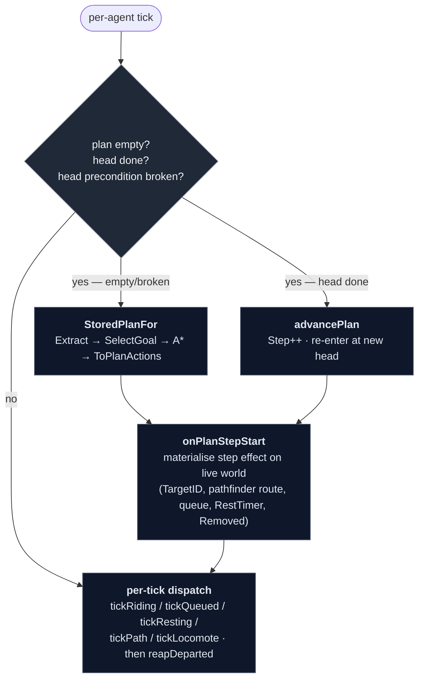

# Skier AI — pipeline overview

The skier AI is split into two layers:

- **L0 — strategic layer**: a per-agent Goal-Oriented Action Planning
  (GOAP) loop in `internal/ai/goap/`. It picks goals and chains actions;
  the head action's destination is the goal target for L1.
- **L1–L3 — continuous controller**: perception → steering decision →
  physics integration in `internal/sim/skiing.go`, running every tick.
  Reactive: given a goal target, ski toward it.

L0 is intentionally thin compared with L1; the per-tick controller never
re-reads strategic state mid-tick. Replanning happens between ticks on
explicit triggers — never as a fixed-interval poll, never per-frame.

Persistent per-agent state on `world.Agent`: `Traits`, `Plan` (the L0
stored plan + L1 goal target), `Balance`, `TurnSide`, `TurnDwell`,
`LastTactical`, `Energy`, `Fun`, `RidenLifts`, `RestTimer`, `Removed`,
`Sense`. Per-tick types (`Perception`, `Decision`) are sim-internal and
never stored.

---

## L0 · Strategic layer — what's in the tree

### GOAP in one paragraph

A planning architecture from F.E.A.R. (Orkin, 2005). Each agent has a
typed **world snapshot**, a small library of **actions** (each with a
precondition, an effect, and a cost), and a small set of **goals** (each
with a "satisfied when" predicate and a weight). At replan time `SelectGoal`
picks the highest-weighted unsatisfied goal, and an A\* search over the
action graph finds the cheapest chain that satisfies it. The output is a
list of actions; the agent executes the head, advances when its effect is
realised, and re-plans when its precondition breaks. New behavior is one
action plus one goal — no state-machine rewrite per combination.

### World snapshot

Per-agent typed snapshot extracted at replan time via `goap.Extract`.
ID-valued where the field is categorical; numeric where natural.

```go
type WorldSnapshot struct {
    Pos        mgl32.Vec3
    Energy     float32          // 0..1 — session fatigue budget
    Fun        float32          // 0..1 — smoothed satisfaction signal
    AtLiftBase uint64           // 0 or lift ID
    AtLiftTop  uint64           // 0 or lift ID
    Queued     uint64           // 0 or lift ID
    OnLift     uint64           // 0 or lift ID
    AtLodge    uint64           // 0 or lodge building ID
    AtParking  uint64           // 0 or parking building ID
    Removed    bool             // terminal — agent has Departed
    RidenLifts map[uint64]int   // per-lift ride count (novelty driver)
}
```

Anchor IDs are populated by proximity to known anchors (8 m radius), with
implicit state markers (`OnLiftID`, `Queued`) overriding proximity. An
agent in transit between anchors lands with all positional IDs zero —
that's the "no anchor" state the planner sees mid-descent. Action
preconditions are usually one comparison; effects are usually one
assignment.

### Actions (8)

| Action | Precondition | Effect (planner-side) | Base cost |
|---|---|---|---|
| `WalkToLift(L)` | no anchors, not on/queued for a lift | `AtLiftBase = L` | `dist(Pos, L.Base) / WalkSpeed` |
| `JoinQueue(L)` | `AtLiftBase == L` | `Queued = L`; `AtLiftBase = 0` | `len(L.Queue) × queueSlotSec` |
| `RideLift(L)` | `Queued == L` or `OnLift == L` | `AtLiftTop = L`; `OnLift = 0`; increment `RidenLifts[L]` | `L.LoopLength / (2·L.Speed)` + repeat penalty |
| `SkiToLift(L)` | `AtLiftTop != 0`; ≥20 m descent to `L.Base` | `AtLiftBase = L`; `AtLiftTop = 0` | `dist / skiSpeedMps` |
| `SkiToLodge(B)` | `AtLiftTop != 0`; ≥20 m descent to `B` | `AtLodge = B`; `AtLiftTop = 0` | `dist / skiSpeedMps` |
| `SkiToParking(B)` | `AtLiftTop != 0`; ≥20 m descent to `B` | `AtParking = B`; `AtLiftTop = 0` | `dist / skiSpeedMps` |
| `RestAtLodge(B)` | `AtLodge == B` | `Energy = 1` | `restDurationSec` (≈60 s) |
| `Depart(B)` | `AtParking == B` | `Removed = true` | `0` (terminal) |

Boarding the chair is folded into `RideLift` — no separate `BoardChair`
step, because there's no game-state effect between queue front and chair
seat the planner would condition on.

**Trail-free reachability.** `SkiTo*` is gated on a minimum elevation
drop (`minDescentMeters = 20 m`) between the source lift top and the
destination, as a stand-in for player-defined trails. Cost is straight-
line distance divided by `skiSpeedMps` — the L1 controller decides the
actual path through terrain.

**Novelty mechanic.** `RideLift.Cost` adds a linear repeat penalty
(`repeatPenaltyPerRide × prior_count`, capped at `repeatPenaltyCap`) so
unridden lifts plan as cheaper. On unload `bumpFunAndRideCount` mirrors
this on the agent: `Fun += 0.15 × 0.55^count`, then `RidenLifts[L]++`.
The two surfaces are kept in sync so the planner's preference matches
the actual Fun outcome.

### Goals (4)

| Goal | Satisfied when | Weight |
|---|---|---|
| `KeepSkiing` | `AtLiftTop != 0` | `Energy` (or `Energy × 0.5` if `Energy < 0.2`) |
| `Rest` | `Energy ≥ 0.85` | `(1 − Energy)²` |
| `Explore` | every lift in `RidenLifts` with count > 0 | `unridden_frac × Energy` |
| `GoHome` | `Removed` | `1.0` if `Energy < 0.05`, else `0` |

`SelectGoal` returns the highest-weighted unsatisfied goal. Energy-low
routing falls out of standard weight evaluation — no special-case branch.

**Note on `KeepSkiing.IsSatisfied = (AtLiftTop != 0)`.** This is a
planner-terminal predicate — "the plan must end at a lift top." It's
transient at runtime: as soon as the skier leaves the top, KeepSkiing
goes unsatisfied. That's intentional given current triggers (the plan in
flight runs to completion without re-electing), but it's the reason the
periodic safety re-check was removed — a wall-clock re-check on a
transient snapshot loops skiers back to the lift indefinitely.

### Plan storage on `world.Agent`

The plan lives on `agent.Plan` as plain data in the leaf `internal/ai`
package (no goap import from `world`, avoiding a cycle):

```go
type Plan struct {
    Goal     GoalKind     // L1 hint: GoalLift / GoalDepart / GoalNone
    GoalID   uint64       // entity the L1 controller is steering toward
    Target   mgl32.Vec3   // L1 target world pos
    GoalName string       // L0 goal name for HUD ("Explore" / "Rest" / ...)
    Steps    []PlanAction // the L0 plan
    Step     int          // index of the current head action
    Prefs    Prefs        // reserved
}

type PlanAction struct {
    Kind   PlanActionKind  // ActWalkToLift / ActJoinQueue / ...
    LiftID uint64          // 0 unless lift-typed
    BldgID uint64          // 0 unless building-typed
    Cost   float32         // planner cost-at-emission, for HUD
}
```

`goap.ToPlanActions` translates the planner's `[]Action` output into
`[]PlanAction` (one switch on concrete type per step). `Planner.StoredPlanFor`
is the runtime entry point — extract snapshot, select goal, plan, translate.

### Replan triggers

1. **Plan empty** — agent just spawned, or the previous plan exhausted.
2. **Head action complete** — fresh snapshot matches the action's post-
   state (`WalkToLift` complete when `snap.AtLiftBase == L`, etc).
3. **Head action precondition broken** — entity referenced by the head
   step no longer exists. Runtime check is laxer than the planner's
   GOAP precondition (just "entity exists"); the stricter GOAP form
   would constantly fail during transit (`SkiToLodge` wants `AtLiftTop != 0`
   which is gone as soon as the skier moves off the top), forcing
   constant replanning.

There is **no periodic safety re-check.** Future "world changed under
the agent" coverage — lift closure, queue spike crossing a threshold,
affect threshold — should land as explicit event hooks that mark
affected agents `Stale` so their next tick replans. A wall-clock poll
collides with transient snapshot predicates and is worse than nothing.

### Pipeline diagram (L0)



`tickPlanning(agent)` runs first per agent each frame and dispatches one
of the three branches. `onPlanStepStart` is the single point that maps
each `PlanAction.Kind` to live sim state — laying pathfinder routes for
walks, appending to lift queues, starting rest timers, marking departed
agents for the post-loop reap. `reapDeparted` splices `Removed` agents
out after the loop so range iteration doesn't shift mid-pass.

### Spawn and load

`tickBuildings` spawns an agent and calls `s.replan(agent)`. The first
step (typically `WalkToLift`) drives `onPlanStepStart` to lay a path
from the parking lot's door to the lift's queue back. Spawn unwinds if
either the planner returns no plan or the pathfinder can't reach the
target.

`NewSimulationWithSeed` walks any pre-existing agents (testbeds, save-
restored) and calls `onPlanStepStart` for each non-empty plan so the
runtime state matches the stored plan before the first tick. Save files
don't serialise `Plan.Steps` — on load the plan is empty and tickPlanning's
plan-empty branch regenerates it from the agent's snapshot.

### HUD

- **followLabel** (centred banner): identity, speed/energy/fun, head
  action's display name.
- **plannerDebugPanel** (F4-toggled): goal-weight ranking computed from
  a fresh snapshot, snapshot anchors, `RidenLifts`, the full stored plan
  with a `→` marker on the current step.

Both read `agent.Plan` directly — never call the planner from the draw
path. The goal-weights table re-extracts a snapshot each frame for the
followed agent only, which is microseconds.

### Lift naming

`PlaceLift` assigns `Lift1`, `Lift2`, ... via `world.nextLiftDefaultName`
at creation time. Players can rename through the lift popup. Plan
readouts use `goap.PlanActionLabel` which resolves IDs to the lift's
name (or `#ID` fallback for unnamed) and to `Lodge#X` / `Lot#X` for
buildings.

---

## L1–L3 · Continuous controller

Continuous steering controller. The pipeline runs once per agent per tick
from `tickSkier` in `internal/sim/skiing.go`. There is **no technique
enum** and **no waypoint planner** — S-turns, brake wedging, and tree
avoidance all emerge from a single steering function reading a small
typed perception bundle.

```mermaid
flowchart TB
  Start([tickSkier · per agent · per tick])

  Start --> Arrival{dist &lt; ArrivalThreshold?}
  Arrival -->|yes| Done([snap to target · return arrived])
  Arrival -->|no| L1

  subgraph L1["L1 · Perception — every tick"]
    direction LR
    Terrain["<b>Terrain</b><br/>NormalAt (snow surface) · SlopeAngle<br/>FallDir · FallScale (smoothstepped [0,1])"]
    Axis["<b>Axis target</b><br/>vector to a.Plan.Target<br/>→ AxisDir · AxisDist · InArrival (&lt;6 m)"]
    Under["<b>Underfoot</b><br/>TreeDensityAt(pos) → AtCellDensity<br/>InTrees flag (display only)"]
  end

  L1 --> L2

  subgraph L2["L2 · Controller (decide) — Perception → Decision"]
    direction TB
    Axis2["<b>composeAxis</b><br/>blend(AxisDir, FallDir·FallScale)<br/>→ axisHeading"]
    Tact["<b>sampleTactical</b><br/>7 candidate offsets · ±60° · 8 segments<br/>horizon = speed·3.5 s clamped [22, 70] m<br/>corridor ±10 m perpendicular — worst-of-three density<br/>score = progress·cos(off) − 4·Σdensity − 8·boundaryHits<br/>+ 0.5·Σgrooming  <i>(centre-only)</i><br/>+ 0.4·sign(prev)·sign(off)  <i>(gated on maxDensity&gt;0.5)</i><br/>+ tiny RNG jitter to break symmetric ties"]
    Speed["<b>targetSpeed</b><br/>ComfortSpeed·(0.7 + 0.6·Aggression)<br/>× 0.5 if InArrival<br/>× (1 − 0.4·clamp(worstProbe/0.4))<br/>floor at skiWalkSpeed (2 m/s)"]
    Brake["<b>brakeAngle</b><br/>overspeed = (Speed − target)/target<br/>brakeAngle = clamp(overspeed·1.5, 0, 40°)"]
    Side["<b>TurnSide commit</b> — persistent, dwell-gated<br/>dropped to 0 when obstacleSeen OR brakeAngle &lt; 8°<br/>flips to opposite when |deviation| &gt; 0.85·brakeAngle<br/>AND TurnDwell ≥ 1.2 s<br/>initial side from heading deviation, else coin-flip"]
    Out["<b>desiredHeading</b> = axisHeading + tactical + side·brakeAngle<br/><b>scrub</b> = 4·(overspeed − 0.6) clamped to 6 m/s²<br/>active only above 60% overspeed"]
    Axis2 --> Tact --> Speed --> Brake --> Side --> Out
  end

  L2 --> L3

  subgraph L3["L3 · Apply — physics integration"]
    direction TB
    Head["<b>heading</b><br/>rotateToward(desired) capped at headingRateMax (40°/s)<br/>— matches realistic edge-transfer rate"]
    Fric["<b>effectiveFriction</b> — snow-modulated (muBase, muEdge)<br/>Grooming · Packed · Powder gate · MogulSize · Ice<br/>each shifts the corduroy baseline (see SNOW.md)"]
    Accel["<b>acceleration</b><br/>a = g·sinθ·cos(off) <br/>− μ_base·g·cosθ<br/>− μ_edge·g·cosθ·|sin(off)|<br/>− k_drag·v²<br/>− dec.Scrub"]
    Pos["<b>position</b><br/>pos.xz += (sin h, cos h)·speed·dt<br/>pos.y = surface elevation<br/>floor speed ≥ skiWalkSpeed (2 m/s)"]
    Head --> Fric --> Accel --> Pos
  end

  L3 --> BalChk{Balance += stressDelta·dt<br/>≤ 0?}
  BalChk -->|yes| Fallen["<b>Fallen</b> · 4 s<br/>resume at Balance 0.7 · TurnSide 0"]
  BalChk -->|no| Snap["<b>recordFrame → Sense</b><br/>follow HUD · perception-cone shader · CSV recorder"]

  classDef layer fill:#0f172a,stroke:#475569,color:#e2e8f0
  classDef phys fill:#7c2d12,stroke:#fb923c,color:#fed7aa
  classDef gate fill:#1f2937,stroke:#9ca3af,color:#f3f4f6
  class L1,L2 layer
  class L3 phys
  class Arrival,BalChk gate
```



### Notes on the architecture

- **Plan A — no technique enum.** Straight, carved, and brake-heavy outputs
  all come from one steering function. The brake angle (`TurnSide ×
  brakeAngle`) is what produces emergent S-turns: while overspeed,
  brakeAngle > 0 → desired heading is off the fall line → edge friction
  scrubs speed → speed drops → brakeAngle shrinks → if heading has reached
  the arc edge on the committed side, flip TurnSide and carve back.
- **No path planner.** `a.Plan.Target` tracks the L1 goal target, set
  once by `onPlanStepStart` per L0 step. There are no waypoints, no
  routes inside L1. The controller seeks the goal directly and lets
  `sampleTactical` deal with obstacles in front of it.
- **Single forward sampler.** `sampleTactical` scores 7 candidate arcs at
  ±60° around `axisHeading`. Each arc is 8 segments deep; every segment
  reads tree density at the centre **and** at ±10 m perpendicular, taking
  the worst — so a path that grazes a tree edge scores as poorly as one
  through the trunk. Boundaries get an 8× penalty, tree density a 4×
  penalty, on-axis progress a +0.3 bonus.
- **Side-commit on obstacles only.** A small bias (+0.4 × sign(prev) ×
  sign(off)) keeps the skier on the same side they chose last tick — but
  only when the fan actually sees an obstacle (`maxDensity > 0.5`). Without
  that gate, `prevTactical` would self-perpetuate and slowly drift the
  skier off-axis even on a clear slope.
- **S-turn suppression while avoiding.** When `obstacleSeen`, TurnSide is
  forced to 0 — the tactical offset already takes the heading off the fall
  line, so cross-fall friction still scrubs speed, and the S-turn
  oscillation would otherwise fight the lateral commitment by swinging
  heading back through axis every cycle. Real skiers don't S-turn through
  trees.
- **Turn dwell minimum.** A committed turn side can't flip again until 1.2 s
  has passed (`turnDwellMin`). Combined with the 40°/s heading rate cap
  this puts each carve at ~1.2 s minimum and a full S-cycle at ~2.4 s —
  cruising rhythm, not slalom.
- **Snow-modulated friction.** `effectiveFriction` reads `SnowAt(pos)` and
  shifts the (muBase, muEdge) pair per Grooming / Packed / Powder /
  MogulSize / Ice. See `SNOW.md` for the multiplier table.
- **Grooming preference in steering.** `sampleTactical` integrates per-
  segment `Grooming` along each candidate arc (centre-only — the edge of
  a groomed strip is still groomed) and adds `0.5 · Σgrooming` to the
  score. On clear slopes this pulls the line onto corduroy; when trees
  are present the 4× density penalty dominates and the grooming term
  just biases tie-breaks. Uniform across skiers — `GroomingPreference`
  trait is deferred.
- **Balance + fall** runs every tick orthogonally to L1–L3. Drains from
  speed/slope overshoot, hard scrub under load, and underfoot tree density
  above 0.3. Recovers at +0.15/s baseline, clamped to [-1, 0.4]/s.
- **Energy** is a session-level fatigue budget. Drains at a flat rate per
  sim-second only while `tickSkier` is on the dispatch path (lift rides,
  queues, walks, and rests don't drain). Fresh = 1.0; budget covers
  `energyBudgetSec` (~800 s, calibrated for ~20 descents). Recovery is
  via the L0 `Rest` goal: `Rest.Weight = (1 − Energy)²` dominates the
  other goals as Energy drops below ~0.38, producing a `SkiToLodge +
  RestAtLodge` plan; `RestAtLodge` restores `Energy = 1`. The skier
  pipeline never reads Energy itself.

---

## Future extensions

Everything below this line is **not implemented** — kept as design notes
so the surface stays predictable when the next slice lands.

### Affect

```go
type Affect struct {
    Mood     float32  // 0..1 — smoothed outcome signal; resort rating reads on Depart
    Patience float32  // 0..1 — drains in queues, recovers otherwise
    Hunger   float32  // 0..1 — grows steadily over a session
    Boredom  float32  // 0..1 — grows steadily, spikes on repeated trail
}
```

Outcome writebacks at action completion (matched difficulty → +Mood,
mismatch → −Mood / −Patience; queue overrun → −Patience; fall →
−Mood / −Patience). Goal weights and action costs read these once they
exist:

| System | Goes into | How |
|---|---|---|
| Skiers angry at lift lines | `JoinQueue` cost | `× (2 − Patience)` |
| Skiers want appropriate runs | `SkiTrail` cost | `+= skillMismatch(Skill, Difficulty)` |
| Beginners avoid black diamonds | `SkiTrail` cost | `+= fearCost(Skill, Difficulty)` |
| Skiers want novelty | `SkiTrail` cost | `+= boredomCost(Trail, RecentRuns, Boredom)` |
| Hunger drives lunch | `Refuel` weight | `Hunger²` |
| Tired skiers go home | `GoHome` weight | `(1 − Energy − Mood) + lateDayBias` |
| Resort rating | EMA of Mood at Depart | top-bar metric |

Affect thresholds (Hunger > 0.7, Patience < 0.1, etc) become explicit
event-driven replan triggers — they mark the agent `Stale` so the next
tick re-plans.

### New actions

- `EatLunch(B)` — `AtLodge == B` and lodge serves meals. Effect:
  `Hunger = 0`, `Mood += 0.3`. Cost: `mealTime`.
- `SkiTrail(T)` — replaces the trail-free `SkiTo*` once trails are first-
  class. Precondition: `AtLiftTop == T.FromLift`. Effect: `AtLiftBase =
  T.ToLift` (or `AtParking = T.ToParking`); push `T.ID` onto a per-agent
  `RecentRuns` ring. Cost includes difficulty / skill / boredom terms.

### Trails as first-class entities

```go
type Trail struct {
    ID         uint64
    Name       string
    Difficulty TerrainDifficulty   // DiffGreen / DiffBlue / DiffBlack
    FromLift   uint64              // lift whose top this trail starts at
    ToLift     uint64              // lift whose base it ends at (0 → parking)
    ToParking  uint64              // alternative endpoint
    Length     float32             // metres
}
```

Trails carry **no waypoints** — the L1 controller is path-free, terrain
represents the physical corridor via Grooming + cleared trees. A trail is
the *semantic* overlay. Placement is a future scenario-editor tool:
click a lift top, then a lift base or parking lot; `Length` falls out of
straight-line distance. `Lift.Services` becomes derived from trails
(`∪ T.Difficulty : T.FromLift == lift.ID`).

### Explicit replan event hooks

Two categories worth implementing when the underlying systems land:

- **World change events.** Lift closed / opened, queue length crossed a
  five-skier threshold, snowcat groomed a run. Mark agents whose plan
  references the affected entity as `Stale`; they replan on their next
  tick (one tick of latency avoids a thundering-herd replan inside the
  event handler).
- **Affect threshold crossings.** Hunger across 0.7, Patience below 0.1,
  Energy across thresholds the smooth weight functions don't already
  catch. Set `Stale` per the same mechanism.

The shared `Stale` flag lets every event source share one replan path.

### Personality traits

Decoupled from `SkillLevel` — personality, not ability.

| Trait | Effect | Layer |
|---|---|---|
| `GroomingPreference` | per-skier weight on the grooming bonus in `sampleTactical` | L1 |
| `GladeTolerance` | shifts the corridor/density penalty per-skier | L1 |
| `PreferredSide` | replaces the symmetric-tie coin-flip in `pickInitialSide` | L1 |
| `Curiosity` | multiplier on `Explore.Weight` | L0 |
| `TiredBias` | multiplier on `Rest.Weight` | L0 |

### Resort rating

`Mood` captured on `Depart`, rolling EMA across the last ~50 departures
(half-life α ≈ 0.05). Surfaced in the top bar alongside cash and guest
count. Optional feedback: low rating modulates parking spawn rate
downward so the player has to actually run a good resort.

### Per-action telemetry

Counters per action — execute / fail-precondition / replaced-by-replan.
Catches dead actions, over-weighted goals, and replan storms in the
editor's affect-tuning panel.

---

## Phased plan

| Phase | Output |
|---|---|
| 0 — design ✅ | This doc + Go skeleton types in `internal/ai/goap/` |
| 1 — planner infrastructure ✅ | `goap` package, `Fun`/`RidenLifts` on Agent, F4 debug panel, lift auto-naming. Observe-only — `pickTopTarget` still drove behaviour. |
| 2 — switchover ✅ | Planner authoritative. `pickTopTarget` / `routeHome` / `onArrive` deleted. Stored `ai.Plan` on Agent with `Steps`/`Step`. Three explicit replan triggers; no wall-clock poll. Save format breaks per `[[feedback_dev_phase_breaking_changes]]`. |
| 3 — affect + costs | `Mood` / `Patience` / `Hunger` / `Boredom` drive weights and costs. Trail data model lands; `Lift.Services` becomes derived from trails. Stale-flag replan event hooks for lift closure / queue spikes. |
| 4 — lodges + rating | `EatLunch` wires to lodge buildings. Resort rating in top bar. Optional spawn-rate feedback. |
| 5 — trail editor + telemetry | Player tool for trail placement. Per-action telemetry catches dead actions and over-weighted goals. |
