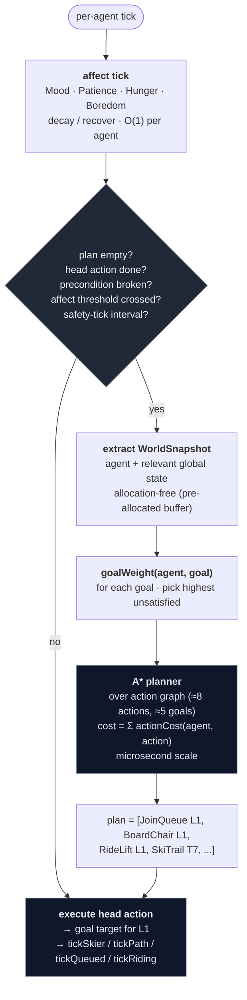

# Skier AI — pipeline overview

The skier AI is split into two layers:

- **L0 — strategic layer** *(MVP landed in `internal/ai/goap/`; observe-only)*:
  a per-agent Goal-Oriented Action Planning (GOAP) loop that picks goals
  and chains actions. Output: one current action whose execution drives
  the goal target for L1.
- **L1–L3 — continuous controller** *(implemented)*: perception → steering
  decision → physics integration, running every tick. Reactive: given a
  goal target, ski toward it.

L0 is deliberately thin compared to L1; the per-tick controller never
re-reads the strategic state mid-tick. Replanning happens between ticks,
event-driven for performance at thousands of agents.

Persistent per-agent state (`Traits`, `Plan`, `Balance`, `TurnSide`,
`TurnDwell`, `LastTactical`, `Energy`, `Fun`, `RidenLifts`, `Sense`)
lives on `world.Agent`. Per-tick types (`Perception`, `Decision`) are
sim-internal and never stored.

---

## L0 MVP — what's in the tree right now

The first GOAP rollout shipped a deliberately narrow slice of the design
below. Implemented in `internal/ai/goap/`, wired into the follow HUD,
**observe-only** — `pickTopTarget` still drives agent behaviour and the
planner output exists solely for live observation. Phase 2 replaces
`pickTopTarget` with `planner.PlanForAgent`.

What landed:

- **Per-agent state:** `Energy` (existing) + `Fun` (smoothed
  satisfaction) + `RidenLifts map[uint64]int` (per-lift ride count).
- **Snapshot:** `goap.WorldSnapshot` with positional ID fields
  (`AtLiftBase`, `AtLiftTop`, `Queued`, `OnLift`, `AtLodge`, `AtParking`,
  `Removed`) extracted by proximity to anchors.
- **Actions (8):** `WalkToLift`, `JoinQueue`, `RideLift` (folded board
  + ride + unload), `SkiToLift`, `SkiToLodge`, `SkiToParking`,
  `RestAtLodge`, `Depart`.
- **Goals (4):** `KeepSkiing`, `Rest`, `Explore`, `GoHome`.
- **Trail-free reachability:** `SkiTo*` is gated on elevation drop ≥
  `minDescentMeters` (20 m) between source lift top and destination —
  stand-in for player-defined trails. Cost is straight-line distance
  divided by `skiSpeedMps`.
- **Novelty mechanic:** `RideLift` completion bumps `Fun` by `0.15 ×
  0.55^count` and increments `RidenLifts[L.ID]`. Planner mirrors this
  with a linearly-growing repeat penalty in `RideLift.Cost` so unridden
  lifts plan as cheaper.
- **Observability:** Compact follow HUD shows identity / speed / energy
  / fun / selected goal / head action. **F4** toggles a deep planner
  debug panel (ranked goal weights with the winner marked, full plan
  with per-action cost-at-snapshot, snapshot anchors, `RidenLifts`
  counts). Per-skier — recomputes every frame for the watched agent.
- **Lift auto-naming:** `PlaceLift` assigns `Lift1`, `Lift2`, ... at
  creation time via `world.nextLiftDefaultName`; the player can rename
  through the lift popup. Plan readouts use the name (or `#ID` fallback)
  via `goap.DisplayName`.

What's deliberately deferred from the full design below:

- **Affect:** no `Patience`, `Boredom`, `Mood` (the implemented `Fun`
  is the lightweight stand-in for Mood). No threshold replan triggers.
- **Hunger / EatLunch / lodges-with-meals:** dropped from MVP. `Rest`
  recovers Energy only.
- **Warmth:** considered for MVP, dropped — without a weather model it
  collapses to a second Energy. Lands with weather.
- **Trails as first-class entities:** deferred. The MVP elevation-gated
  SkiTo* generalises the planner without forcing players to author trails.
- **Per-action telemetry, threshold-driven replan, periodic safety
  re-checks:** Phase 3+.

A small `internal/ai/goap/planner_test.go` covers the three flows that
matter for the MVP (ride-from-parking, prefer-unridden, rest-at-low-
energy).

---

## L0 · Strategic layer — Goal-Oriented Action Planning *(full design; MVP subset landed — see above)*

### What GOAP is

A planning architecture from F.E.A.R. (Jeff Orkin, 2005). Instead of an
explicit state machine per agent, each agent has

- a **current world snapshot** (typed: agent position, energy, hunger,
  which lifts they've ridden recently, etc.),
- a small library of **actions**, each with a precondition (when can it
  run), effect (what it changes about the snapshot), and base cost,
- a small set of **goals**, each with a "satisfied when" predicate and a
  weight,

and an **A\*** planner searches the action graph backward from the highest-
weighted goal to find the cheapest action chain that reaches it from the
current state. The output is a list of actions; the agent executes the
head action, advances when its effect is realised, replans when a
precondition breaks. Multi-step plans like *walk to lift → queue → board
→ ride → ski Trail A → walk to lodge → eat lunch* come out of the
planner natively; the agent never needs a state for each combination.

Why GOAP over a state machine: compound plans emerge from action chaining
rather than added states, and new behavior is one action + one goal
rather than a state-machine rewrite. Why GOAP over Utility AI: GOAP is
the lighter-weight architecture once you need *multi-step* plans
(sequence of actions to satisfy one goal) rather than just "pick the
best single next action right now."

### Pipeline diagram (L0)



### World snapshot

Per-agent typed snapshot extracted at replan time. Numeric where natural,
ID-valued where the field is categorical:

```go
type WorldSnapshot struct {
    Pos        mgl32.Vec3
    Energy     float32   // 0..1 — existing fatigue budget
    Hunger     float32   // 0..1 — affect
    Patience   float32   // 0..1
    Boredom    float32   // 0..1
    AtLiftBase uint64    // 0 if not at a lift base, else lift ID
    AtLiftTop  uint64    // 0 or lift ID
    Queued     uint64    // 0 or lift ID
    OnLift     uint64    // 0 or lift ID
    AtLodge    uint64    // 0 or lodge building ID
    AtParking  uint64    // 0 or parking building ID
    RecentRuns []uint64  // most recent first; ring buffer of trail IDs
}
```

Booleans are implicit in the IDs: `AtLiftBase != 0` means "agent is at
the base of some lift." Numeric thresholds are evaluated by preconditions
directly (e.g. `Hunger > 0.7`) — no quantisation to a "hungry" bool.
Action preconditions are usually one comparison; effects are usually one
assignment.

### Actions (≈8 to start)

| Action | Precondition | Effect | Base cost |
|---|---|---|---|
| `WalkToLift(L)` | `!OnLift && !Queued` | `AtLiftBase = L` | `dist(Pos, L.Base) / WalkSpeed` |
| `JoinQueue(L)` | `AtLiftBase == L` | `Queued = L` | `len(L.Queue) × 1.0` |
| `BoardChair(L)` | `Queued == L` | `OnLift = L`; `Queued = 0` | `0` (folded into Queue) |
| `RideLift(L)` | `OnLift == L` | `AtLiftTop = L`; `OnLift = 0`; `Energy += rideRefresh` | `L.LoopLength / (2·L.Speed)` |
| `SkiTrail(T)` | `AtLiftTop == T.FromLift` | `AtLiftBase = T.ToLift` (or `AtParking`); `Energy −= T.Length × c`; push `T.ID` onto `RecentRuns` | `T.Length × diffMultiplier(T.Difficulty) × skillMismatch(agent.Skill, T.Difficulty)` |
| `RestAtLodge(B)` | `!OnLift && !Queued` | `AtLodge = B`; `Energy += rest rate × dt`; `Mood += 0.2` | `dist(Pos, B.Pos) / WalkSpeed` |
| `EatLunch(B)` | `AtLodge == B` | `Hunger = 0`; `Mood += 0.3` | `mealTime × 1.0` |
| `Depart` | `AtParking != 0` | agent removed; final Mood captured for resort rating | `0` (terminal) |

Cost above is the *base*; per-agent multipliers go through
`actionCost(agent, action, snapshot)`. See *Game systems* below.

### Goals (≈5 to start)

| Goal | Satisfied when | Weight function |
|---|---|---|
| `KeepSkiing` | (never; baseline drive) | `Energy × (1 − Hunger) × (1 − Boredom)` |
| `Refuel` | `Hunger ≤ 0.1` | `Hunger²` |
| `Rest` | `Energy ≥ 0.85` | `(1 − Energy)² × tiredBias(agent)` |
| `Explore` | one trail not in `RecentRuns` has been skied | `Boredom × CuriosityTrait` |
| `GoHome` | agent removed at parking | `clamp(1 − Energy − Mood, 0, 1) + lateDayBias` |

Skier picks the highest-weighted unsatisfied goal at replan time. Each
plan pursues a single goal; multi-goal pursuit emerges from replanning
between goals as each is satisfied. The existing `energyLowThreshold`
hard cut (`pickTopTarget` reroutes to a lodge below 0.05) is subsumed by
`Rest.Weight = (1 − Energy)²` — no special-case branch, falls out of
standard weight evaluation.

### Affect state on `world.Agent`

```go
type Affect struct {
    Mood       float32   // 0..1 — smoothed outcome signal; resort rating reads on Depart
    Patience   float32   // 0..1 — drains in queues (≈ −0.01/s); recovers otherwise (≈ +0.005/s)
    Hunger     float32   // 0..1 — grows ~0.0008/s (≈ 30 min sim to half-hungry)
    Boredom    float32   // 0..1 — grows ~0.001/s; large spike (+0.4) on repeated trail
    RecentRuns []uint64  // ring buffer · capacity 6 · most-recent first
}
```

`Energy` already exists on Agent; `Affect` extends it. Outcome writebacks
on action completion:

- `SkiTrail(T)` where `T.Difficulty` matches Skill → `Mood += 0.05`
- `SkiTrail(T)` where mismatch is large → `Mood -= 0.05`, `Patience -= 0.1`
- `JoinQueue` completed after waiting > 30 s → `Patience -= 0.02 × overrun`
- `EatLunch` → `Hunger = 0`, `Mood += 0.1`
- Fall (L1's BalChk path) → `Mood -= 0.05`, `Patience -= 0.1`

### Replan triggers — event-driven, scale to thousands

A naive *replan every tick* is O(agents × planning) per frame and
collapses at thousands of agents. The architecture is event-driven:

- **Plan empty** → first-plan (agent just spawned)
- **Head action done** (its effect is now true in the live world) →
  advance; if plan is exhausted, replan
- **Head action's precondition broken mid-execution** (e.g. the lift the
  plan boards just closed) → replan
- **Affect threshold crossed**: Hunger across 0.7, Energy across 0.05,
  Patience below 0.1 → replan
- **External world event**: lift closed/opened, queue length crossed a
  5-skier threshold → mark agents whose current plan references that lift
  as `Stale`; they replan on their next tick (one tick of latency is
  fine and avoids a thundering-herd replan inside the event handler)
- **Periodic safety re-check** every ~30 sim-seconds *per agent*,
  staggered across the agent list. At 1000 agents × 30 fps that's
  ~1 agent/frame doing a safety replan — bounded cost.

A\* over an 8-node action graph with ~5 candidate goals is microseconds
per call. The dominant cost is the snapshot extraction; pre-allocate a
single snapshot struct per agent so steady-state planning is allocation-
free. At thousands of agents the typical frame does zero or single-digit
replans; only world-event flurries (a lift closure) push it higher and
those are bounded by the agent count, not the planner.

### Game systems wire into two functions

All gameplay tuning concentrates in:

```go
func goalWeight(a *Agent, g Goal, w *WorldSnapshot) float32
func actionCost(a *Agent, act Action, w *WorldSnapshot) float32
```

The planner itself stays clean (A\* + preconditions only, no game-design
knobs inside the planner). Every requested game system maps onto one of
these two functions:

| System | Goes into | How |
|---|---|---|
| Skiers enjoy appropriate runs | `Mood` writeback on `SkiTrail` | matched difficulty → `+0.05`; mismatch → `−0.05` |
| Skiers get angry at lift lines | `actionCost(JoinQueue(L))` | `× (2 − a.Patience)` — low Patience makes long queues prohibitive |
| Skiers get angry at lunch lines | `actionCost(EatLunch(B))` | same shape: `× (2 − a.Patience)` when lodge has a queue |
| Skiers look for appropriate runs | `actionCost(SkiTrail(T))` | `+= skillMismatch(a.Skill, T.Difficulty)`; planner naturally routes to lifts whose trails match |
| Beginners avoid black diamonds | `actionCost(SkiTrail(T))` | `+= fearCost(a.Skill, T.Difficulty)`; large for low Skill × Black |
| Skiers want novelty | `actionCost(SkiTrail(T))` | `+= boredomCost(T, a.RecentRuns, a.Boredom)`; recent trails penalised |
| Hunger drives lunch | `goalWeight(Refuel)` | `Hunger²` — re-prioritises away from KeepSkiing once Hunger climbs |
| Tired skiers go home | `goalWeight(GoHome)` | `(1 − Energy − Mood) + lateDayBias` |
| Resort rating | EMA of `Mood` at `Depart` | top-bar metric; optional feedback into parking spawn rate |

Personality traits already listed in *Future extension points* below
(`GroomingPreference`, `GladeTolerance`, `PreferredSide`) plug into
`actionCost` and the L1 sampler with the same *one knob per trait*
pattern.

### Resort rating

`Mood` is captured when an agent runs `Depart`. The resort's overall
rating is a rolling exponential moving average across the last ~50
departures (half-life α ≈ 0.05). Surfaced in the top bar alongside cash
and guest count. Optional feedback loop: low rating modulates the parking
lot's mean spawn rate downward — fewer arrivals when the resort is bad —
so the player actually has to run a good resort.

---

## Trails — player-defined first-class entities *(proposed)*

L0 needs a trail concept because `SkiTrail(T)` is the action whose cost
varies with skill / difficulty / novelty; `RecentRuns` is a list of trail
IDs; and players already want to *name* their runs ("Bunny Hill",
"Devil's Drop") the same way they already name lifts.

### Data model

```go
type Trail struct {
    ID         uint64
    Name       string
    Difficulty TerrainDifficulty   // single bit: one of DiffGreen / DiffBlue / DiffBlack
    FromLift   uint64              // lift whose top this trail starts at
    ToLift     uint64              // lift whose base this trail ends at (0 → ends at parking)
    ToParking  uint64              // alternative endpoint; non-zero when ToLift == 0
    Length     float32             // metres; computed once at placement
}
```

Trails carry **no waypoints**. The L1–L3 controller is path-free and the
existing terrain system already represents the physical corridor
implicitly via Grooming + cleared trees. A trail is the *semantic*
overlay: "the route from lift X top to lift Y base, named Z, marked blue."

### Placement (future scenario-editor tool)

A new toolbar tool ("Trail" alongside "Lift" / "Road"): player clicks a
lift top, then a lift base (or a parking lot). The system creates a
`Trail`, computes `Length` from straight-line distance — on-snow descent
length emerges from the L1 controller's curve through terrain. The player
separately uses the existing Glade / Grooming tools to physically shape
the corridor.

### `Lift.Services` becomes derived

The current `Lift.Services` bitfield is derivable from trails:

```
lift.Services = ∪{ T.Difficulty : trail T with T.FromLift == lift.ID }
```

The lift-popup toggle row either becomes read-only (computed) or stays
editable but auto-syncs the trails. Recommended: derivation — the player
edits trails (where names live), and the lift markers are a summary view.

### How L0 uses trails

- `SkiTrail(T)` precondition: `AtLiftTop == T.FromLift`
- `SkiTrail(T)` effect: `AtLiftBase = T.ToLift` (or `AtParking =
  T.ToParking`); push `T.ID` onto `RecentRuns`
- Cost: `T.Length × diffMultiplier(T.Difficulty) ×
  skillMismatch(agent.Skill, T.Difficulty) × (1 + boredomPenalty(T,
  agent.RecentRuns) × agent.Boredom)`
- Trail discovery: agents start with empty per-agent `Explored` sets;
  `Explore.Weight` rises when at a lift top with unexplored trails

Multiple trails from the same lift top let the planner choose between
e.g. a green and a black at the same vista — the action graph fans on
`SkiTrail(T)` for each `T` whose precondition matches.

---

## L1–L3 · Continuous controller *(implemented)*

Continuous steering controller. The pipeline runs once per agent per tick
from `tickSkier` in `internal/sim/skiing.go`. There is **no technique enum**
and **no waypoint planner** — S-turns, brake wedging, and tree avoidance all
emerge from a single steering function reading a small typed perception
bundle.

```mermaid
flowchart TB
  Start([tickSkier · per agent · per tick])

  Start --> Arrival{dist &lt; ArrivalThreshold?}
  Arrival -->|yes| Done([snap to target · return arrived])
  Arrival -->|no| PlanRefresh

  PlanRefresh["<b>Plan refresh</b> — on goal change only<br/>strategic layer is intentionally thin;<br/>per-tick controller never re-reads goal"] --> L1

  subgraph L1["L1 · Perception — every tick"]
    direction LR
    Terrain["<b>Terrain</b><br/>NormalAt (snow surface) · SlopeAngle<br/>FallDir · FallScale (smoothstepped [0,1])"]
    Axis["<b>Axis target</b><br/>vector to a.Plan.Target<br/>→ AxisDir · AxisDist · InArrival (&lt;6 m)"]
    Under["<b>Underfoot</b><br/>TreeDensityAt(pos) → AtCellDensity<br/>InTrees flag (display only)"]
  end

  L1 --> L2

  subgraph L2["L2 · Controller (decide) — Perception → Decision"]
    direction TB
    Axis2["<b>composeAxis</b><br/>blend(AxisDir, FallDir·FallScale)<br/>→ axisHeading"]
    Tact["<b>sampleTactical</b><br/>7 candidate offsets · ±60° · 8 segments<br/>horizon = speed·3.5 s clamped [22, 70] m<br/>corridor ±10 m perpendicular — worst-of-three density<br/>score = progress·cos(off) − 4·Σdensity − 8·boundaryHits<br/>+ 0.5·Σgrooming  <i>(centre-only)</i><br/>+ 0.4·sign(prev)·sign(off)  <i>(gated on maxDensity&gt;0.5)</i><br/>+ tiny RNG jitter to break symmetric ties"]
    Speed["<b>targetSpeed</b><br/>ComfortSpeed·(0.7 + 0.6·Aggression)<br/>× 0.5 if InArrival<br/>× (1 − 0.4·clamp(worstProbe/0.4))<br/>floor at skiWalkSpeed (2 m/s)"]
    Brake["<b>brakeAngle</b><br/>overspeed = (Speed − target)/target<br/>brakeAngle = clamp(overspeed·1.5, 0, 40°)"]
    Side["<b>TurnSide commit</b> — persistent, dwell-gated<br/>dropped to 0 when obstacleSeen OR brakeAngle &lt; 8°<br/>flips to opposite when |deviation| &gt; 0.85·brakeAngle<br/>AND TurnDwell ≥ 1.2 s<br/>initial side from heading deviation, else coin-flip"]
    Out["<b>desiredHeading</b> = axisHeading + tactical + side·brakeAngle<br/><b>scrub</b> = 4·(overspeed − 0.6) clamped to 6 m/s²<br/>active only above 60% overspeed"]
    Axis2 --> Tact --> Speed --> Brake --> Side --> Out
  end

  L2 --> L3

  subgraph L3["L3 · Apply — physics integration"]
    direction TB
    Head["<b>heading</b><br/>rotateToward(desired) capped at headingRateMax (40°/s)<br/>— matches realistic edge-transfer rate"]
    Fric["<b>effectiveFriction</b> — snow-modulated (muBase, muEdge)<br/>Grooming · Packed · Powder gate · MogulSize · Ice<br/>each shifts the corduroy baseline (see SNOW.md)"]
    Accel["<b>acceleration</b><br/>a = g·sinθ·cos(off) <br/>− μ_base·g·cosθ<br/>− μ_edge·g·cosθ·|sin(off)|<br/>− k_drag·v²<br/>− dec.Scrub"]
    Pos["<b>position</b><br/>pos.xz += (sin h, cos h)·speed·dt<br/>pos.y = surface elevation<br/>floor speed ≥ skiWalkSpeed (2 m/s)"]
    Head --> Fric --> Accel --> Pos
  end

  L3 --> BalChk{Balance += stressDelta·dt<br/>≤ 0?}
  BalChk -->|yes| Fallen["<b>Fallen</b> · 4 s<br/>resume at Balance 0.7 · TurnSide 0"]
  BalChk -->|no| Snap["<b>recordFrame → Sense</b><br/>follow HUD · perception-cone shader · CSV recorder"]

  classDef layer fill:#0f172a,stroke:#475569,color:#e2e8f0
  classDef phys fill:#7c2d12,stroke:#fb923c,color:#fed7aa
  classDef gate fill:#1f2937,stroke:#9ca3af,color:#f3f4f6
  class L1,L2 layer
  class L3 phys
  class Arrival,BalChk gate
```



### Notes on the architecture

- **Plan A — no technique enum.** Straight, carved, and brake-heavy outputs
  all come from one steering function. The brake angle (`TurnSide ×
  brakeAngle`) is what produces emergent S-turns: while overspeed,
  brakeAngle > 0 → desired heading is off the fall line → edge friction
  scrubs speed → speed drops → brakeAngle shrinks → if heading has reached
  the arc edge on the committed side, flip TurnSide and carve back.
- **No path planner.** `a.Plan` only tracks the current goal target. There
  are no waypoints, no routes. The controller seeks the goal directly and
  lets `sampleTactical` deal with obstacles in front of it.
- **Single forward sampler.** `sampleTactical` scores 7 candidate arcs at
  ±60° around `axisHeading`. Each arc is 8 segments deep; every segment
  reads tree density at the centre **and** at ±10 m perpendicular, taking
  the worst — so a path that grazes a tree edge scores as poorly as one
  through the trunk. Boundaries get an 8× penalty, tree density a 4×
  penalty, on-axis progress a +0.3 bonus.
- **Side-commit on obstacles only.** A small bias (+0.4 × sign(prev) ×
  sign(off)) keeps the skier on the same side they chose last tick — but
  only when the fan actually sees an obstacle (`maxDensity > 0.5`). Without
  that gate, `prevTactical` would self-perpetuate and slowly drift the
  skier off-axis even on a clear slope.
- **S-turn suppression while avoiding.** When `obstacleSeen`, TurnSide is
  forced to 0 — the tactical offset already takes the heading off the fall
  line, so cross-fall friction still scrubs speed, and the S-turn
  oscillation would otherwise fight the lateral commitment by swinging
  heading back through axis every cycle. Real skiers don't S-turn through
  trees.
- **Turn dwell minimum.** A committed turn side can't flip again until 1.2 s
  has passed (`turnDwellMin`). Combined with the 40°/s heading rate cap
  this puts each carve at ~1.2 s minimum and a full S-cycle at ~2.4 s —
  cruising rhythm, not slalom.
- **Snow-modulated friction.** `effectiveFriction` reads `SnowAt(pos)` and
  shifts the (muBase, muEdge) pair per Grooming / Packed / Powder /
  MogulSize / Ice. See `SNOW.md` for the multiplier table.
- **Grooming preference in steering.** `sampleTactical` integrates per-
  segment `Grooming` along each candidate arc (centre-only — the edge of
  a groomed strip is still groomed) and adds `0.5 · Σgrooming` to the
  score. On clear slopes this pulls the line onto corduroy; when trees
  are present the 4× density penalty dominates and the grooming term
  just biases tie-breaks. Uniform across skiers — `GroomingPreference`
  trait is deferred.
- **Balance + fall** runs every tick orthogonally to L1–L3. Drains from
  speed/slope overshoot, hard scrub under load, and underfoot tree density
  above 0.3. Recovers at +0.15/s baseline, clamped to [-1, 0.4]/s.
- **Energy** is a session-level fatigue budget. Drains at a flat rate per
  sim-second only while `tickSkier` is on the dispatch path (lift rides
  and walks don't drain). Fresh = 1.0; budget covers `energyBudgetSec`
  (~800 s, calibrated for ~20 descents). Once below `energyLowThreshold`
  (~0.05), decision boundaries outside the skier pipeline reroute the
  agent home: `pickTopTarget` picks a lodge at lift unload, and
  `onArrive(targetLift)` paths the skier to a lodge instead of queueing.
  The skier pipeline itself never reads `Energy`. *(L0 subsumes this:
  `Rest.Weight = (1 − Energy)²` drives the same behavior with no
  special-case branch.)*
- **Lift selection.** `pickTopTarget` chooses the next destination at
  every lift unload. Above the energy threshold it picks any lift in the
  resort uniformly at random; below it picks a lodge. *(L0 deletes this:
  the planner picks the next action — `WalkToLift(L)` or
  `RestAtLodge(B)` — based on goal weights and action costs.)*

### Future extension points

| Trait | Effect | Status |
|---|---|---|
| `GroomingPreference` | Per-skier weight on the grooming bonus in `sampleTactical` | Deferred (uniform for now) |
| `GladeTolerance` | Shifts the corridor/density penalty per-skier; advanced glade skiers tolerate density up to ~0.8 before going aversive | Deferred (constant for now) |
| `PreferredSide` | Replaces the symmetric-tie coin-flip in `pickInitialSide` with a per-skier preference | Deferred (random for now) |
| `Curiosity` | Multiplier on `Explore.Weight` in L0 | Deferred (L0 not landed) |
| `TiredBias` | Multiplier on `Rest.Weight` in L0 | Deferred (L0 not landed) |

The first three are personality dimensions for the L1 controller; the
last two are personality dimensions for the L0 planner. All five are
deliberately decoupled from `SkillLevel` — personality, not skill.

---

## Phased plan

| Phase | Output | Risk |
|---|---|---|
| **0 — design** ✅ | This doc + Go skeleton types compiling in `internal/ai/goap/` | Low |
| **1 — planner infrastructure** ✅ | `goap` package: State, Action, Goal, Plan, Planner (A\*). `Fun` + `RidenLifts` fields on Agent. Compact follow HUD + F4 deep debug panel (ranked goal weights, full plan with per-action costs, snapshot anchors, RidenLifts). Lift auto-naming (`Lift1`/`Lift2`/...). Old `pickTopTarget` still drives behaviour. Trail-free `SkiTo*` actions stand in for `SkiTrail(T)`. Warmth / Hunger / EatLunch / Patience / Boredom / Mood deferred to Phase 3. | Low — pure infrastructure |
| **2 — switchover** | Full action set wired. `pickTopTarget` and the state-dispatch in `tickAgents` deleted. Save format breaks (per [[feedback_dev_phase_breaking_changes]]); no reproduction of current behavior required. | Medium — emergent behavior may diverge from today's; that's accepted |
| **3 — affect + costs** | Mood / Patience / Hunger / Boredom drive goal weights and action costs. Trail data model lands; `Lift.Services` becomes derived from trails. | Medium — tuning constants emerge from playtest |
| **4 — lodges + rating** | `RestAtLodge` / `EatLunch` actions wire to lodge buildings (which currently don't have spawn behavior). Resort rating in top bar. Optional spawn-rate feedback. | Low (mirrors lift pattern) |
| **5 — trail editor + telemetry** | Player tool for trail placement. Per-action telemetry (execute / fail / replaced counts) catches dead actions and over-weighted goals. Editor-only affect-tuning panel. | Low |
