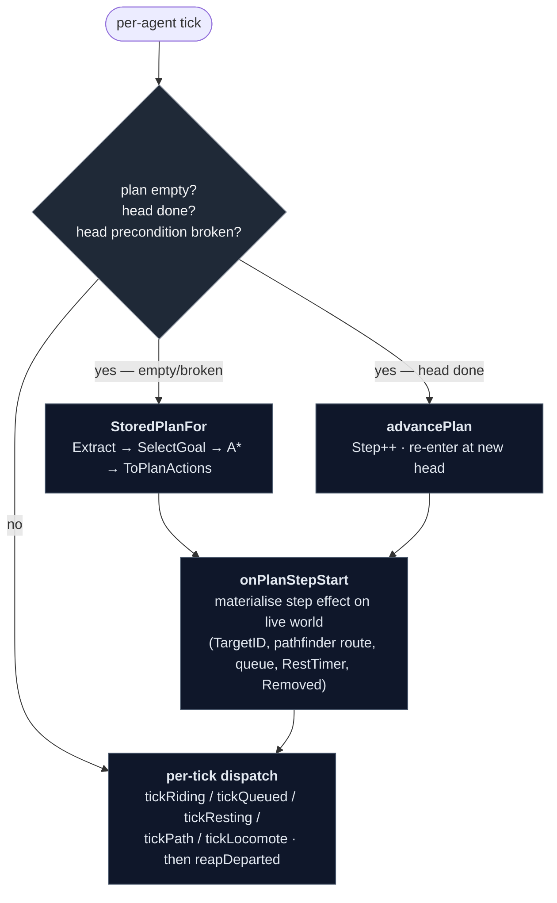

# Guest AI — pipeline overview

The guest AI is split into two layers:

- **L0 — strategic layer**: a per-agent Goal-Oriented Action Planning
  (GOAP) loop in `internal/ai/goap/`. It picks goals and chains actions;
  the head action's destination is the goal target for L1.
- **L1–L3 — continuous controller**: perception → steering decision →
  physics integration in `internal/sim/skiing.go`, running every tick.
  Reactive: given a goal target, ski toward it.

L0 is intentionally thin compared with L1; the per-tick controller never
re-reads strategic state mid-tick. Replanning happens between ticks on
explicit triggers — never as a fixed-interval poll, never per-frame.

Persistent per-guest state on `world.Guest`: `Traits`, `Plan` (the L0
stored plan + L1 goal target), `Balance`, `TurnSide`, `TurnDwell`,
`LastTactical`, `Patience`, `Energy`, `Hunger`, `Thirst`, `Satisfaction`,
`RidenLifts`, `RestTimer`, `Removed`, `Sense`. Per-tick types
(`Perception`, `Decision`) are sim-internal and never stored.

---

## L0 · Strategic layer — what's in the tree

### GOAP in one paragraph

A planning architecture from F.E.A.R. (Orkin, 2005). Each agent has a
typed **world snapshot**, a small library of **actions** (each with a
precondition, an effect, and a cost), and a small set of **goals** (each
with a "satisfied when" predicate and a weight). At replan time `SelectGoal`
picks the highest-weighted unsatisfied goal, and an A\* search over the
action graph finds the cheapest chain that satisfies it. The output is a
list of actions; the agent executes the head, advances when its effect is
realised, and re-plans when its precondition breaks. New behavior is one
action plus one goal — no state-machine rewrite per combination.

### World snapshot

Per-agent typed snapshot extracted at replan time via `goap.Extract`.
ID-valued where the field is categorical; numeric where natural.

```go
type WorldSnapshot struct {
    Pos        mgl32.Vec3
    Patience   float32          // 0..1 — drains queuing, restored by skiing/riding/lodge
    Energy     float32          // 0..1 — drains skiing, restored by RestAtLodge
    Hunger     float32          // 0..1 — fixed drain, restored by EatAtFoodCourt; hits 0 → GoHome
    Thirst     float32          // 0..1 — altitude+exertion drain, restored at a bar; hits 0 → GoHome
    AtLiftBase uint64           // 0 or lift ID
    AtLiftTop  uint64           // 0 or lift ID
    Queued     uint64           // 0 or lift ID
    OnLift     uint64           // 0 or lift ID
    AtLodge    uint64           // 0 or lodge building ID
    AtParking  uint64           // 0 or parking building ID
    Removed    bool             // terminal — agent has Departed
    RidenLifts map[uint64]int   // per-lift ride count (novelty driver)
}
```

Anchor IDs are populated by proximity to known anchors (8 m radius), with
implicit state markers (`OnLiftID`, `Queued`) overriding proximity. An
agent in transit between anchors lands with all positional IDs zero —
that's the "no anchor" state the planner sees mid-descent. Action
preconditions are usually one comparison; effects are usually one
assignment.

### Actions (8)

| Action | Precondition | Effect (planner-side) | Base cost |
|---|---|---|---|
| `WalkToLift(L)` | no anchors, not on/queued for a lift | `AtLiftBase = L` | `dist(Pos, L.Base) / WalkSpeed` |
| `JoinQueue(L)` | `AtLiftBase == L` | `Queued = L`; `AtLiftBase = 0` | `len(L.Queue) × queueSlotSec` |
| `RideLift(L)` | `Queued == L` or `OnLift == L` | `AtLiftTop = L`; `OnLift = 0`; increment `RidenLifts[L]` | `L.LoopLength / (2·L.Speed)` + repeat penalty |
| `SkiToLift(L)` | `AtLiftTop != 0`; ≥20 m descent to `L.Base` | `AtLiftBase = L`; `AtLiftTop = 0` | `dist / skiSpeedMps` |
| `SkiToLodge(B)` | `AtLiftTop != 0`; ≥20 m descent to `B` | `AtLodge = B`; `AtLiftTop = 0` | `dist / skiSpeedMps` |
| `SkiToParking(B)` | `AtLiftTop != 0`; ≥20 m descent to `B` | `AtParking = B`; `AtLiftTop = 0` | `dist / skiSpeedMps` |
| `RestAtLodge(B)` | `AtLodge == B` | `Patience = 1` | `restDurationSec` (≈60 s) |
| `EatAtFoodCourt(B)` | `AtLodge == B`; `B` has Food tiles and a door; `Diners < Seats`; budget ≥ `MealPrice` | `Hunger = 1`; budget −= `MealPrice` | `mealDurationSec` (90 s) |
| `Depart(B)` | `AtParking == B` | `Removed = true` | `0` (terminal) |

Boarding the chair is folded into `RideLift` — no separate `BoardChair`
step, because there's no game-state effect between queue front and chair
seat the planner would condition on.

**Trail-free reachability.** `SkiTo*` is gated on a minimum elevation
drop (`minDescentMeters = 20 m`) between the source lift top and the
destination, as a stand-in for player-defined trails. Cost is straight-
line distance divided by `skiSpeedMps` — the L1 controller decides the
actual path through terrain.

**Novelty mechanic.** `RideLift.Cost` adds a linear repeat penalty
(`repeatPenaltyPerRide × prior_count`, capped at `repeatPenaltyCap`) so
unridden lifts plan as cheaper. On unload `RidenLifts[L]++` is
incremented. A lift with no trail at the guest's own level costs
`belowLevelPenaltySec` more, so they ride it only when nothing at their
level runs.

### Goals (4)

| Goal | Satisfied when | Weight | Notes |
|---|---|---|---|
| `KeepSkiing` | `AtLiftTop != 0` | `Patience` (×0.5 if `Patience < 0.2`) | lapping fallback when Explore done |
| `Rest` | `Patience ≥ 0.85` | `(1 − Patience)²` | fires a `SkiToLodge + RestAtLodge` plan |
| `Explore` | every **accessible** lift ridden once | `unridden_accessible_frac × Patience` | filtered by guest skill level |
| `RelieveHunger` | `Hunger ≥ 0.25` | `1.05 + (0.25 − Hunger)` below 0.25, else 0 | fires a trip to the nearest food court; skipped when none is reachable |
| `GoHome` | `Removed` | `1.0` if `min(Patience,Energy) < 0.05` or `Hunger < 0.05` or `Thirst < 0.05`, else `0` | fires on exhaustion, starvation, or dehydration |

**Goal priority**: `SelectGoal` picks the highest-weighted *unsatisfied* goal
whose weight is **> 0**. Zero-weight goals are skipped — `GoHome` at full
patience never wins by default fallthrough.

**Explore skill filter**: `Explore.IsSatisfied` and `Explore.Weight` only
count lifts accessible to the guest's skill level (`liftAccessible` helper,
same filter as `WalkToLift` / `JoinQueue` preconditions).

**Default lap plan**: when no unsatisfied goal has positive weight (Explore
done, Rest not needed, GoHome not triggered), `planFromSnap` calls
`defaultLapPlan` which directly builds `[SkiToLift, JoinQueue, RideLift]`
targeting the skill-accessible lift with the fewest prior rides. This keeps
skiers lapping indefinitely rather than stopping after the first visit.

**Note on `KeepSkiing.IsSatisfied = (AtLiftTop != 0)`.** This is a
planner-terminal predicate — "the plan must end at a lift top." It's
satisfied in any lookahead snapshot (`ExtractLookahead` sets `AtLiftTop`),
so `defaultLapPlan` handles the "keep going" case directly rather than
relying on KeepSkiing to produce a new plan after every unload.

### Plan storage on `world.Guest`

The plan lives on `guest.Plan` as plain data in the leaf `internal/ai`
package (no goap import from `world`, avoiding a cycle):

```go
type Plan struct {
    Goal     GoalKind     // L1 hint: GoalLift / GoalDepart / GoalNone
    GoalID   uint64       // entity the L1 controller is steering toward
    Target   mgl32.Vec3   // L1 target world pos
    GoalName string       // L0 goal name for HUD ("Explore" / "Rest" / ...)
    Steps    []PlanAction // the L0 plan
    Step     int          // index of the current head action
    Prefs    Prefs        // reserved
}

type PlanAction struct {
    Kind   PlanActionKind  // ActWalkToLift / ActJoinQueue / ...
    LiftID uint64          // 0 unless lift-typed
    BldgID uint64          // 0 unless building-typed
    Cost   float32         // planner cost-at-emission, for HUD
}
```

`goap.ToPlanActions` translates the planner's `[]Action` output into
`[]PlanAction` (one switch on concrete type per step). `Planner.StoredPlanFor`
is the runtime entry point — extract snapshot, select goal, plan, translate.

### Replan triggers

1. **Plan empty** — agent just spawned, or the previous plan exhausted.
2. **Head action complete** — fresh snapshot matches the action's post-
   state (`WalkToLift` complete when `snap.AtLiftBase == L`, etc).
3. **Head action precondition broken** — entity referenced by the head
   step no longer exists.
4. **Queue cap reject** — `JoinQueue.Precondition` fails when
   `len(Queue) > MaxQueuePersons (20)` and `Patience ≥ 0.05`. The planner
   therefore never builds a plan through a full queue; it tries other
   accessible lifts instead. If all lifts are over the cap the planner
   returns empty, `replan` detects the empty plan while the guest is
   anchored at a lift base or top, exhausts Patience, and retries —
   `GoHome` now wins and the guest departs. The `Patience < 0.05`
   exception preserves the GoHome routing invariant: a departing guest
   still needs to join a queue and ride up to exit a lift base; the cap
   must not block that escape path.
   An execution-time safety-net in `onPlanStepStart` catches the race
   where the queue grew past the cap between plan time and arrival:
   it emits `ThoughtLineTooLong` (−0.08 Satisfaction), zeroes Patience,
   and calls `replan` — the same zero-then-replan pattern as the original
   bail, so GoHome routing through JoinQueue doesn't re-trigger the check.

**Unloading** (`internal/sim/unloading.go`): when a chair's progress crosses 0.5, each rider is stood up on the snow under their seat (`seatWorldPos` at the top, from the chair mesh's slots), facing up the lift line, with `Guest.Unload` set. Their side (−1..+1) comes from the slot's chair-local Z, or from the seat index when no slots are registered (headless). Then `advancePlan` moves past `RideLift`. While `Unload.LiftID` is set and they aren't fallen, `tickGuests` runs `tickUnloading` instead of planning or skiing. That's a scripted glide at 2.5 m/s, 4 m straight, then a 6 m arc turning 30° (middle seats) to 70° (outer seats) toward their side, starting early if someone is down within 4 m ahead. It ends in normal skiing at the arc's heading and speed. Balance is held at 1. `unloadFallChance` rolls at the start (beginners 3% fixed-grip, 1% detachable; intermediates 0.5% / 0.2%; advanced 0.1% / 0; gondolas 0). A rider who falls goes down between 1 m and the middle of the arc, takes `ThoughtFellUnloading` (−0.05) and an `EventFall`, recovers through `tickFallen`, and finishes the glide. The renderer draws them easing from the seat's height to the snow over the first 1.25 m (`Unloading.UnloadLift`). The activity reads "Unloading".

**Mid-ride lookahead replanning**: when an agent boards a chair,
`replanOnBoard` calls `StoredPlanForLookahead` with an `ExtractLookahead`
snapshot (simulates post-ride state, pre-records the ride). The result is
stored with a prepended `RideLift` step so `advancePlan` at unload lands
directly on the first post-ride action. Guests always have a plan visible
while riding; the player sees intent the whole time.

**Need preemption at step boundaries**: each plan records which needs
(hunger, thirst) were already pressing when it was made
(`Plan.Pressing`). When a head step completes, `goap.NeedPreempts`
checks whether a need has since crossed its goal threshold and now
outweighs the plan's goal; if so the guest replans instead of advancing.
A hungry skier mid-lap heads for lunch at the next lift top or run end
rather than finishing a plan drawn up before they got hungry. It never
fires on leaving `JoinQueue` (the guest is in the lift line) or on a
`GoHome` plan. A need already pressing at plan time, such as hunger with
no reachable food court, doesn't preempt again, so there's no replan
loop.

There is **no periodic safety re-check.** Future coverage (lift closure,
queue spike) should land as explicit event hooks, not a wall-clock poll.

### Pipeline diagram (L0)



`tickPlanning(agent)` runs first per agent each frame and dispatches one
of the three branches. `onPlanStepStart` is the single point that maps
each `PlanAction.Kind` to live sim state — laying pathfinder routes for
walks, appending to lift queues, starting rest timers, marking departed
agents for the post-loop reap. `reapDeparted` splices `Removed` agents
out after the loop so range iteration doesn't shift mid-pass.

### Spawn and load

`spawnGuest` places an agent at a parking lot and calls `s.replan(agent)`.
The first step drives `onPlanStepStart` to lay a path from the lot's door:
to a ticket office for guests without a pass, or to the lift's queue back
for pass holders (`WalkToLift`). Spawn unwinds if the planner returns no
plan or the pathfinder can't reach a `WalkToLift` target.

### Tickets

Guests arrive without a ticket. `JoinQueue` requires `HasSeasonPass ||
HasDayTicket`, so every riding plan for a guest without a pass starts
`WalkToTicketOffice` → `BuyDayTicket` (or `BuySeasonPass` when the
`GetSeasonPass` goal wins and the guest can afford it). The planner picks
the Tickets door by walk cost. `BuyDayTicket` pays `DayTicketDue`, which spawn
already set aside from `RemainingBudget`, so the planner's budget math
already reflects it. The planner's closed-set key includes both ticket
flags.

A guest who can't get a ticket gives up: if the pathfinder finds no route
to the office, or no riding goal can be planned while the guest has no
ticket, they think "couldn't find where to buy a ticket"
(`ThoughtNoTicketWindow`) and head home. Without any ticket office, the
demand poll doesn't send guests without a pass at all (see [[Demand Spec]]).

`NewSimulationWithSeed` walks any pre-existing agents (testbeds, save-
restored) and calls `onPlanStepStart` for each non-empty plan so the
runtime state matches the stored plan before the first tick. Save files
don't serialise `Plan.Steps` — on load the plan is empty and tickPlanning's
plan-empty branch regenerates it from the agent's snapshot.

### HUD

- **followLabel** (centred banner): identity, speed/energy/fun, head
  action's display name.
- **plannerDebugPanel** (F4-toggled): goal-weight ranking computed from
  a fresh snapshot, snapshot anchors, `RidenLifts`, the full stored plan
  with a `→` marker on the current step.

Both read `agent.Plan` directly — never call the planner from the draw
path. The goal-weights table re-extracts a snapshot each frame for the
followed agent only, which is microseconds.

### Lift naming

`PlaceLift` assigns `Lift1`, `Lift2`, ... via `world.nextLiftDefaultName`
at creation time. Players can rename through the lift popup. Plan
readouts use `goap.PlanActionLabel` which resolves IDs to the lift's
name (or `#ID` fallback for unnamed) and to `Lodge#X` / `Lot#X` for
buildings.

---

## L1–L3 · Continuous controller

Continuous steering controller. The pipeline runs once per agent per tick
from `tickSkier` in `internal/sim/skiing.go`. There is **no technique
enum** and **no waypoint planner** — S-turns, brake wedging, and tree
avoidance all emerge from a single steering function reading a small
typed perception bundle.

```mermaid
flowchart TB
  Start([tickSkier · per agent · per tick])

  Start --> Arrival{dist &lt; ArrivalThreshold?}
  Arrival -->|yes| Done([snap to target · return arrived])
  Arrival -->|no| L1

  subgraph L1["L1 · Perception — every tick"]
    direction LR
    Terrain["<b>Terrain</b><br/>NormalAt (snow surface) · SlopeAngle<br/>FallDir · FallScale (smoothstepped [0,1])"]
    Axis["<b>Axis target</b><br/>vector to a.Plan.Target<br/>→ AxisDir · AxisDist · InArrival (&lt;6 m)"]
    Under["<b>Underfoot</b><br/>TreeDensityAt(pos) → AtCellDensity<br/>InTrees flag (display only)"]
  end

  L1 --> L2

  subgraph L2["L2 · Controller (decide) — Perception → Decision"]
    direction TB
    Axis2["<b>composeAxis</b><br/>blend(AxisDir, FallDir·FallScale)<br/>→ axisHeading"]
    Tact["<b>sampleTactical</b><br/>7 candidate offsets · ±60° · 8 segments<br/>horizon = speed·3.5 s clamped [22, 70] m<br/>corridor ±10 m perpendicular — worst-of-three density<br/>score = progress·cos(off) − 4·Σdensity − 8·boundaryHits<br/>+ 0.5·Σgrooming  <i>(centre-only)</i><br/>+ 0.4·sign(prev)·sign(off)  <i>(gated on maxDensity&gt;0.5)</i><br/>+ tiny RNG jitter to break symmetric ties"]
    Speed["<b>targetSpeed</b><br/>ComfortSpeed·(0.7 + 0.6·Aggression)<br/>× 0.5 if InArrival<br/>× (1 − 0.4·clamp(worstProbe/0.4))<br/>floor at skiWalkSpeed (2 m/s)"]
    Brake["<b>brakeAngle</b><br/>overspeed = (Speed − target)/target<br/>brakeAngle = clamp(overspeed·1.5, 0, 40°)"]
    Side["<b>TurnSide commit</b> — persistent, dwell-gated<br/>dropped to 0 when obstacleSeen OR brakeAngle &lt; 8°<br/>flips to opposite when |deviation| &gt; 0.85·brakeAngle<br/>AND TurnDwell ≥ 1.2 s<br/>initial side from heading deviation, else coin-flip"]
    Out["<b>desiredHeading</b> = axisHeading + tactical + side·brakeAngle<br/><b>scrub</b> = 4·(overspeed − 0.6) clamped to 6 m/s²<br/>active only above 60% overspeed"]
    Axis2 --> Tact --> Speed --> Brake --> Side --> Out
  end

  L2 --> L3

  subgraph L3["L3 · Apply — physics integration"]
    direction TB
    Head["<b>heading</b><br/>rotateToward(desired) capped at headingRateMax (40°/s)<br/>— matches realistic edge-transfer rate"]
    Fric["<b>effectiveFriction</b> — snow-modulated (muBase, muEdge)<br/>Grooming · Packed · Powder gate · MogulSize · Ice<br/>each shifts the corduroy baseline (see Snow Spec)"]
    Accel["<b>acceleration</b><br/>a = g·sinθ·cos(off) <br/>− μ_base·g·cosθ<br/>− μ_edge·g·cosθ·|sin(off)|<br/>− k_drag·v²<br/>− dec.Scrub"]
    Pos["<b>position</b><br/>pos.xz += (sin h, cos h)·speed·dt<br/>pos.y = surface elevation<br/>floor speed ≥ skiWalkSpeed (2 m/s)"]
    Head --> Fric --> Accel --> Pos
  end

  L3 --> BalChk{Balance += stressDelta·dt<br/>≤ 0?}
  BalChk -->|yes| Fallen["<b>Fallen</b> · 4 s<br/>resume at Balance 0.7 · TurnSide 0"]
  BalChk -->|no| Snap["<b>recordFrame → Sense</b><br/>follow HUD · perception-cone shader · CSV recorder"]

  classDef layer fill:#0f172a,stroke:#475569,color:#e2e8f0
  classDef phys fill:#7c2d12,stroke:#fb923c,color:#fed7aa
  classDef gate fill:#1f2937,stroke:#9ca3af,color:#f3f4f6
  class L1,L2 layer
  class L3 phys
  class Arrival,BalChk gate
```



### Notes on the architecture

- **Plan A — no technique enum.** Straight, carved, and brake-heavy outputs
  all come from one steering function. The brake angle (`TurnSide ×
  brakeAngle`) is what produces emergent S-turns: while overspeed,
  brakeAngle > 0 → desired heading is off the fall line → edge friction
  scrubs speed → speed drops → brakeAngle shrinks → if heading has reached
  the arc edge on the committed side, flip TurnSide and carve back.
- **No path planner.** `a.Plan.Target` tracks the L1 goal target, set
  once by `onPlanStepStart` per L0 step. There are no waypoints, no
  routes inside L1. The controller seeks the goal directly and lets
  `sampleTactical` deal with obstacles in front of it.
- **Single forward sampler.** `sampleTactical` scores 7 candidate arcs at
  ±60° around `axisHeading`. Each arc is 8 segments deep; every segment
  reads tree density at the centre **and** at ±10 m perpendicular, taking
  the worst — so a path that grazes a tree edge scores as poorly as one
  through the trunk. Boundaries get an 8× penalty, tree density a 4×
  penalty, on-axis progress a +0.3 bonus.
- **Side-commit on obstacles only.** A small bias (+0.4 × sign(prev) ×
  sign(off)) keeps the skier on the same side they chose last tick — but
  only when the fan actually sees an obstacle (`maxDensity > 0.5`). Without
  that gate, `prevTactical` would self-perpetuate and slowly drift the
  skier off-axis even on a clear slope.
- **S-turn suppression while avoiding.** When `obstacleSeen`, TurnSide is
  forced to 0 — the tactical offset already takes the heading off the fall
  line, so cross-fall friction still scrubs speed, and the S-turn
  oscillation would otherwise fight the lateral commitment by swinging
  heading back through axis every cycle. Real skiers don't S-turn through
  trees.
- **Turn dwell minimum.** A committed turn side can't flip again until 1.2 s
  has passed (`turnDwellMin`). Combined with the 40°/s heading rate cap
  this puts each carve at ~1.2 s minimum and a full S-cycle at ~2.4 s —
  cruising rhythm, not slalom.
- **Snow-modulated friction.** `effectiveFriction` reads `SnowAt(pos)` and
  shifts the (muBase, muEdge) pair per Grooming / Packed / Powder /
  MogulSize / Ice. See [[Snow Spec]] for the multiplier table.
- **Grooming preference in steering.** `sampleTactical` integrates per-
  segment `Grooming` along each candidate arc (centre-only — the edge of
  a groomed strip is still groomed) and adds `0.5 · Σgrooming` to the
  score. On clear slopes this pulls the line onto corduroy; when trees
  are present the 4× density penalty dominates and the grooming term
  just biases tie-breaks. Uniform across skiers — `GroomingPreference`
  trait is deferred.
- **Balance + fall** runs every tick orthogonally to L1–L3. Drains from
  speed/slope overshoot, hard scrub under load, and underfoot tree density
  above 0.3. Recovers at +0.15/s baseline, clamped to [-1, 0.4]/s.
- **Patience** is the session frustration budget. Drains only while
  queuing (`−1/600` per sim-second); restored by active skiing
  (`+1/1000` per sim-second), riding (`+1/800` per sim-second), and
  instantly by `RestAtLodge`. The L0 `Rest` goal fires at low patience
  (`Rest.Weight = (1 − Patience)²`), producing a `SkiToLodge +
  RestAtLodge` plan. `GoHome` fires when Patience < 0.05. The skier
  physics pipeline never reads Patience itself.
- **Hunger and Thirst** are countdown timers. Both are randomised to
  `[0.5, 1.0)` at spawn and drain continuously during every skiing tick.
  A food-court meal restores Hunger; a bar restores Thirst. Hunger
  drains at a fixed `1/900` per sim-second (five clock hours to empty).
  Thirst drains at
  `1/900 × altitudeFactor × exertionMultiplier` — altitude adds
  `+0.05%` per metre above sea level; the exertion table matches the
  energy-drain skill×terrain tiers but is capped at 3×. When either
  drops below 0.15, `ThoughtHungry` / `ThoughtThirsty` is emitted each
  TTL window. When either hits 0.05, `GoHome` fires and the guest
  departs. Guests reach a building only through its doors, and head
  for the door of the service the next step needs
  (`NearestServiceEntrance`: Lounge to rest, Food to eat, Bar to
  drink, Tickets to buy); a meal holds one of the food court's seats
  for 90 s and charges the building's `MealPrice`, a drink its
  `DrinkPrice`.

---

## Per-session stats, rating, and thoughts

### Patience, Energy, Hunger, Thirst

`Patience` (0..1) is the guest's tolerance budget for the session. It starts
at 1.0 on arrival. When it reaches 0, `GoHome` fires and the guest leaves.

`Energy` (0..1) is the physical fatigue budget. Drains while skiing; restored
by `RestAtLodge`. When it reaches 0, `GoHome` fires.

`Hunger` and `Thirst` (0..1) are countdown timers, restored by a food-court
meal and a bar drink respectively. Both start at a random value in
`[0.5, 1.0)` at spawn. When either reaches 0, `GoHome` fires. See the L1–L3
notes above for drain rates.

**Write sites:**

| Source | Rate | Activity |
|---|---|---|
| Active skiing (`tickSkier`) | `+1/1000` per sim-second | restores slowly from fun descents |
| Riding a lift chair (`tickRiding`) | `+1/800` per sim-second | restores: chair ride offsets earlier wait |
| Lodge rest (`tickResting`) | instant `= 1` | full restore on `RestAtLodge` completion |

Patience is clamped to `[0, 1]` on every write.

### Satisfaction, Rating, and Thoughts

`Guest.Satisfaction` (0..1) is the guest's mood for the visit. It starts at 0.6. When they leave, it's captured as `LastScore` and added to the day's departures in `History`. At rollover, `World.Rating` becomes the average of the day's departures (`History.DayRating`); a day with no departures keeps the previous rating. [[Demand]] reads `World.Rating`.

Satisfaction changes in exactly two ways, and both read one table, `ai.Effects`, indexed by `ThoughtKind`:

- **Drift** (`Simulation.tickMood`, every tick, for every guest on the mountain whatever they're doing). The target is `Guest.Baseline`, plus the grooming pull from the last skiing tick (+0.15 on groomed snow and −0.08 off it, for guests whose tastes prefer groomed snow, `Tastes.PrefersGroomed`: groomed ≥ 0.3), plus the pull of every active condition, clamped to [0.15, 0.90]. Satisfaction closes 0.6% of the gap per sim second.
- **Events** (`Simulation.applyEvent`). A one-off delta, clamped to [0, 1], plus the row's `Baseline` change, with the baseline clamped to [0.15, 0.85].

**Tastes.** `GuestTraits.Tastes` (`ai.Tastes`) holds seven affinities from −1 to +1, in `TasteKind` order: groomed, powder, moguls, trees, steep, ice, crowds. `world.RollTastes` picks an archetype by its share at the guest's skill tier (`ai.Archetypes`: Cruiser, Powder Hound, Bump Skier, Glade Rat, Charger), then draws each affinity around its centre with a 0.25 spread. `ai.TasteLabel` names the nearest archetype for the follow panel. Until snow underfoot reads tastes ([[Snow Tastes]] step 2), the glade and corduroy reactions use `Tastes.LikesGlades` (trees ≥ 0.4) and `Tastes.PrefersGroomed` (groomed ≥ 0.3). Saved as `tastes`; saves without it roll tastes from the guest's ID. `TraitsFor` (testbeds) gives beginners and intermediates the Cruiser centre and advanced guests neutral tastes.

**The baseline** starts at 0.5 on arrival and is the guest's memory of the day; it doesn't decay. Lowered by injured (−0.05), hurt and going home (−0.03), abandoned (−0.10), slow patrol (−0.03), too much for me (−0.02), and caught in an avalanche (−0.03). Raised by a great run, by 0.04 × 0.6^t × 0.75^l (`applyEventScaled` in `judgeRun`), where t and l count this visit's earlier great runs on the same main trail and off the same lift (`Guest.TrailTally`, `Guest.LiftTally`). The lift is `Run.LiftID`, the one unloaded from. So one trail tops out near 0.57, and one lift near 0.66 however many trails it serves. `Satisfaction` and `Baseline` are saved for guests on the mountain.

Every change is reported by a thought, and no thought changes a stat by itself.

**Conditions** hold for a while. `Simulation.setCondition` turns one on (adding its thought once, counted for the day) or off; `Guest.Conditions` is the bitmask. Needs start below 0.15 and clear above 0.25 (`holds`).

| Condition | On | Off | Pull |
|---|---|---|---|
| `ThoughtLovingGlades` / `ThoughtScaredInTrees` | tree cover ≥ 0.30 while skiing (loving if `Tastes.LikesGlades`: trees ≥ 0.4) | below 0.20, or not skiing | +0.12 / −0.18 |
| `ThoughtHungry`, `ThoughtThirsty`, `ThoughtImpatient` | Hunger, Thirst, Patience < 0.15 | > 0.25 | −0.10 each |
| `ThoughtTired` | Energy < 0.15 (and not exhausted) | > 0.25 | 0 |
| `ThoughtExhausted` | min(Patience, Energy) < 0.05 | > 0.15 | 0 |
| `ThoughtTooExpensive` | budget below the cheapest ticket | can pay | 0 |
| `ThoughtNeedsLodge` | the planner's `Rest` goal found no lodge (`Plan.Blocked`) | a plan without it | −0.10 |
| `ThoughtLiftsClosed`, `ThoughtNothingForMe`, `ThoughtNoTicketWindow` | the planner couldn't plan a ride, and why | a plan without it | 0 |
| `ThoughtTooEasy` | a run mostly on trails below the guest's level | a run at or above it | −0.08 |

**Events** happen once.

| Event | Delta | Where |
|---|---|---|
| `ThoughtFell` | −0.10 | `skiing.go`, balance → 0 |
| `ThoughtHitTree` | −0.15 | `treeHit`; an injury may follow |
| `ThoughtCaughtInAvalanche` | −0.10 | then a fall or injury |
| `ThoughtInjured` / `ThoughtHurtGoingHome` | −0.25 / −0.15 | `injure`, serious or minor |
| `ThoughtAbandoned` | −0.30 | `tickFallen`, the wait ran out |
| `ThoughtPatrolFast` / `ThoughtPatrolCame` / `ThoughtPatrolSlow` | +0.06 / +0.02 / −0.08 | `patrolReached`: ≤ 120, between, ≥ 300 sim s from injury to a patroller |
| `ThoughtLongLine`, `ThoughtLineTooLong` | −0.08 | `ActJoinQueue` |
| `ThoughtGoodMeal`, `ThoughtGoodDrink`, `ThoughtRested` | +0.05, +0.04, +0.03 | `tickResting`, when the visit finishes |
| `ThoughtGreatRun` | +0.04 | `judgeRun` |
| `ThoughtTooHard` | −0.08 | `judgeRun` |
| `ThoughtCrowdedRun` | −0.05 | `judgeRun` |
| `ThoughtLovingCorduroy` | +0.05 | `judgeRun`, a `Tastes.PrefersGroomed` guest on a run ≥ 90% groomed |

**Runs.** Each descent step (`SkiToLift`, `SkiToLodge`, `SkiToParking`, `SkiTrail`) starts a `Guest.Run` (`startRun`). Every skiing tick adds to it (`recordRun`): seconds on green, blue, and black trail cells (`World.TrailAt`, an index rebuilt with the trail graph) or off-trail, seconds on up to four trails, seconds more than 5° past `ComfortSlope`, other moving skiers within about 7 m × seconds, grooming × seconds, distance, and the starting elevation. When the step completes, `judgeRun` scores runs of 20 s or more. The run's difficulty is the one with the most time, counted when at least half the run was on trails. Too hard: a difficulty above the guest's level, or a quarter of the run past the steep margin. Crowded: on average 1.5 or more skiers nearby. Great: at their level, not too hard, not crowded, no fall since the start, and at least 40 m of vertical. Thoughts name the run's main trail.

**Terrain and skill.** Guests ride any lift serving a trail at or below their level (`skillDiff`; advanced guests ride anything), and prefer one at their level: a lift without one costs 240 s more in the planner (`belowLevelPenaltySec`). [[Demand]] sends guests at full rate when a trail matches their level, and at 0.4 when only easier trails exist (`terrainMatch`).

**Closing time.** While `World.ClosedForDay` is set (by `tickResortClosed`, mirroring `Simulation.ClosedForDay`), `GoHome.Weight` returns 2.0, above every other goal (`Rest` peaks at 1.5), and lift lines are sent home at the moment of closing. Guests' stats aren't touched, so patience keeps draining on the way out.

**Departure reasons.** `Guest.DepartReason` is set once, when the guest decides to leave: explicitly for closing time, a minor injury or patrol first aid, being abandoned, and no route to a ticket window; otherwise by `departReasonFor` when the planner picks `GoHome`, or at `ActDepart` as a fallback. In that order: closing time, no ticket window, lifts stopped, nothing to ski, out of money, patience gone (lines), out of energy, hunger, thirst, else done for the day. `History` counts reasons per day for the "Why guests left" chart. Done, tired, hungry, thirsty, and closing are an ordinary end to the day (`ai.DepartNormal`).

**The thoughts ring.** It holds the last 6 thoughts (`thoughtsCap`) and doesn't skip repeats. `CurrentThought` returns the newest thought still on the guest's mind: an event within `ThoughtTTL` (12 sim s), or a condition that still holds. `ThoughtCounts` and the day's tally count each event and each start of a condition; the "Guest thoughts" chart ranks them by count.

---

## Guest exit

A guest exits in exactly one way: the `GoHome` goal wins the planner, producing
a `[SkiToParking, Depart]` plan. The `Depart` step is terminal — no further
replanning occurs after it starts.

### What triggers GoHome

`GoHome.Weight = 1.0` when `min(Patience, Energy) < 0.05`, or when
`Hunger < 0.05`, or when `Thirst < 0.05`; otherwise 0. There are three
distinct gameplay paths and it matters which one fired:

**Happy path — Energy or hunger/thirst depletion.** The guest has had a full
day on the mountain and is physically spent or simply ran out of food and
water. Energy drains at 1/7200 per sim-second (~2 h continuous to empty);
falls add a −0.30 one-shot hit; overmatched terrain drains up to 6× faster.
Hunger drains at 1/900 per sim-second (five clock hours); Thirst at 1/900 ×
altitude × exertion. A resort with food courts and bars keeps guests out
longer. All three start at natural levels (Energy = 1.0; Hunger and
Thirst randomised to 0.5–1.0 at spawn). `ThoughtHungry` / `ThoughtThirsty`
appear in the ring as the guest gets low, so the departure thought reflects
the cause. No guest satisfaction penalty — the player did nothing wrong.

**Unhappy path — Queue cap rejection.** The guest is leaving frustrated.
When all accessible lifts are at or above the 20-person cap, the planner
returns empty and Patience is zeroed immediately. `ThoughtLineTooLong` —
"that line will take forever" — is emitted at the moment of rejection,
before `replan` fires. The `Patience < 0.05` carve-out in `JoinQueue`'s
precondition keeps the departure route open so a guest at a lift base can
still ride up to exit.

**Spawn failure** (not a true GoHome path). If `tickBuildings` can't route the
first step of a new guest's plan, the agent is rolled back immediately:
`ResetForDeparture` is called and the guest never enters `OnMountain`.

**Implementation note.** Every unhappy-path exit must carry a negative exit
thought — it is the primary signal the player has for diagnosing why guests
left. If a new unhappy GoHome trigger is added, emit its thought in `replan`
before `onPlanStepStart`, guarded on `prevHeadKind != ActSkiToParking` so it
fires once when GoHome first wins, not on every subsequent replan.

### The departure sequence

When `GoHome` wins, the plan is `[SkiToParking(P), Depart(P)]`:

- **`SkiToParking`** — L1 steers the guest down to the parking-lot entrance,
  same physics as any other ski step.
- **`Depart`** (`onPlanStepStart`, `simulation.go`) — a single call that does
  everything before the tick advances:
  1. `departReasonFor` fills in `DepartReason` if nothing set it earlier.
  2. `Demand.recordDeparture` captures `Satisfaction` as `LastScore` and
     increments `LifetimeVisits`, `VisitsThisSeason`, `LastVisit`.
  3. `History.RecordDeparture(satisfaction, reason)` counts the departure,
     adds its satisfaction to the day's sum, and counts its reason.
  4. The parking lot's `CurrentCars` is decremented by `1/GuestsPerCar`
     (4 departures = −1 visible car).
  5. `a.Removed = true` — the agent is inert for the rest of the tick.

### Reap and recycle

`reapDeparted` runs at the end of `tickGuests`, iterating `OnMountain` in
reverse and calling `w.RemoveFromOnMountain` for each flagged agent. Reverse
iteration keeps index arithmetic correct as elements are spliced out.

The `Guest` pointer itself is not freed. `ResetForDeparture` clears every
transient field (Pos, Speed, Plan, Balance, Patience, Satisfaction, Thoughts,
RidenLifts, …) while preserving identity and career stats (`LifetimeVisits`,
`VisitsThisSeason`, `LastVisit`, `LastScore`). The same pointer can be reused
by a future arrival without allocation.

### Departure reasons

See "Departure reasons" under Satisfaction, Rating, and Thoughts. The daily "Why guests left" chart shows the last day's counts.

### Departure's effect on demand

`World.Rating` feeds the arrival-rate formula (see `demand.go`). It is the
average final `Satisfaction` of the previous day's departures, set at
rollover, so a bad day shows up in the next day's arrivals.
